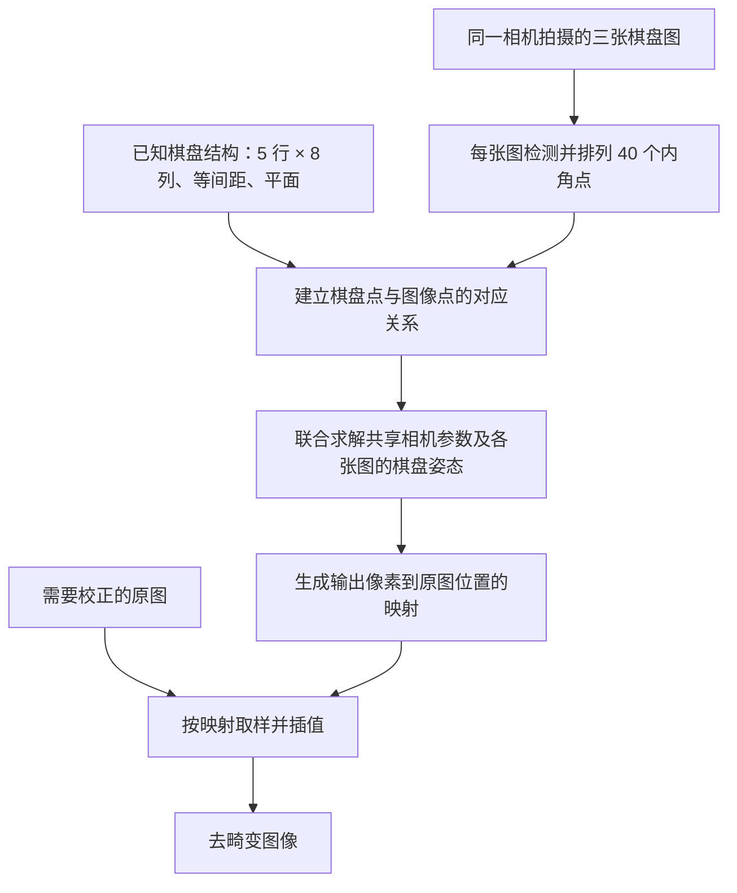
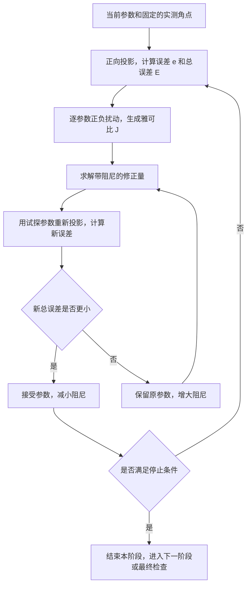

# 算法总览：从棋盘角点到相机标定与去畸变

## 1. 整个过程在解决什么问题

现实中的棋盘具有已知结构：所有内角点位于同一平面，横纵相邻角点间距相等，两组方向互相垂直。拍成照片以后，棋盘的位置、大小和形状会随拍摄角度改变，镜头还可能让原本的直线弯曲。

算法先测出照片中的角点，再寻找一套相机参数，使“规则棋盘经过相机成像”所预测的位置，尽量接近这些测量位置。得到参数后，就能计算校正图像的每个像素应从原图哪里取颜色。



这三个阶段传递的数据不同：

| 阶段     | 输入                             | 输出                                               |
| -------- | -------------------------------- | -------------------------------------------------- |
| 角点检测 | 一张棋盘图、内角点行列数         | 按行列排列的二维亚像素坐标，或检测失败             |
| 相机标定 | 三组角点、棋盘几何结构、图像尺寸 | 相机内参、畸变系数、每张图的姿态、误差与有效性判断 |
| 去畸变   | 原图、有效相机参数               | 校正后的图像                                       |

棋盘只在标定阶段需要出现。同一相机、相同成像设置和分辨率下，参数可以用于后续不含棋盘的图像。

## 2. 如何从图像中找到棋盘内角点

### 2.1 先明确要找的点

内角点是棋盘内部四个方格相交的位置，绕点一圈会看到黑、白、黑、白交替。本项目当前寻找的是 **5 行 × 8 列，共 40 个内角点**，不是 5×8 个方格，也不是棋盘外轮廓的四个角。

检测过程分两层：先找到局部外观像角点的位置，再判断这些位置能否组成指定的棋盘网格。

### 2.2 用灰度变化找候选角点

算法先把彩色图变成灰度图，关注亮暗结构。随后用 Sobel 计算每个位置的水平、垂直亮度变化，也就是图像梯度。

可以把一个小窗口分别向不同方向轻轻移动，想象其中的灰度会怎样变化：

- 均匀区域：向哪里移动都变化很小。
- 一条边缘：跨过边缘变化大，沿着边缘移动变化小。
- 两组边缘的交点：向不同方向移动都会产生明显变化。

Shi–Tomasi 响应把这个区别变成一个分数：汇总小窗口中的梯度，形成一个 2×2 矩阵，取它较小的特征值。较小的值也足够大，说明窗口在两个独立方向上都有明显变化，因此更像角点。

程序保留超过全图最大响应一定比例的点，并进行局部极大值筛选，避免把一个响应峰周围的每个像素都算成角点。此时得到的是**候选点**，背景文字、纹理和其他物体也可能产生候选点。

### 2.3 合并重复点，并识别黑白四格交汇

模糊、较宽的印刷边缘可能让一个实际交点附近出现多个候选点。算法先合并邻近响应，做一次亚像素精定位，再合并仍然靠得很近的点。

接着，以每个候选点为中心沿圆环采样灰度。真实棋盘内角点附近应具有这些特征：

- 绕一圈发生四次亮暗切换。
- 相对的两段亮度大体相似。
- 黑白区域具有足够反差，各段不会极短或占据大半个圆。

程序还会在相近的半径上复查。圆环半径根据附近点的间距调整，目的是观察交点周围的四个格子。使用圆环让这个判断不必假设棋盘边缘与图像水平、垂直方向一致。

这一步利用的是棋盘的局部黑白结构；满足它仍不代表整张棋盘已经找到。

### 2.4 把散点组织成 5×8 网格

标定需要知道“这个图像点是棋盘的第几行、第几列”，仅有 40 个无序坐标还不够。

算法尝试不同的网格方向，把候选点投影到该方向的两个坐标轴上，分出各行，再按行内位置排列。每行选择连续、间距相对规则的 8 个点，然后检查整个网格：相邻边不能过短，间距变化不能过于突然，连续边的方向应当相近，每个小格不能交叉或翻折。

透视和畸变会让图像上的格子不再严格等大、等距，因此检查允许一定变化。程序从有效排列中选择几何代价较小的一组；它不会为了凑齐数量而补造缺失的内角点。

最后统一行列方向和起点，得到可以与规则棋盘对应的有序点列。普通黑白棋盘没有唯一的物理方向标记，因此这里的起点是按图像位置确定的，不表示跨照片识别出了某个带编号的实体角点。对于本项目的相机标定，棋盘对称翻转可由该张图的姿态吸收。

### 2.5 为什么还需要亚像素精定位

实际交点可能位于 `(320.27, 181.64)`，而不在整数像素中心。只保留整数位置，会把像素网格的量化误差带进后续参数计算。

亚像素定位在候选点附近观察多条边缘的梯度。梯度近似垂直于边缘；从一处边缘采样点沿边缘走向延伸，应当接近共同交点。算法综合窗口内这些约束，给予中心附近样本更高权重，求出交点相对当前位置的小位移。

随后移动窗口中心，重新采样并求位移，直到位置变化足够小。亚像素取样通过邻近像素插值完成。若局部信息不足、迭代不收敛或位置漂移过远，就保留此次精定位前的位置。

这个过程是在估计边缘的共同交点，没有把交点强行吸附到一张人为生成的规则网格上。

### 2.6 大图为什么先缩小再检测

本项目对较大的图像先尝试缩小检测，减轻宽边缘附近的多重响应，并寻找整体网格。找到后，把角点坐标恢复到原图，在原始分辨率重新精定位；如果较小的棋盘在缩图中消失或检测失败，再尝试原分辨率检测。

因此最终输出仍是原图坐标。一次成功检测交给标定阶段的是 40 个测量坐标及其行列对应关系，而不是绘制在图上的绿色标记。

## 3. 如何通过角点计算相机参数

**畸变参数是通过“预测角点与实测角点的误差”拟合出来的。** 程序知道棋盘上各点的规则排列，也测到了它们在照片中的位置；它不断调整相机内参、棋盘姿态和畸变系数，让同一套成像模型尽量解释所有照片中的角点。

### 3.1 已知什么，未知什么

给棋盘建立自己的坐标系。若相邻内角点距离为 `s`，第 r 行、第 c 列的点可以写成：

```text
棋盘坐标 P = (c × s, r × s, 0)
图像测量坐标 q = (u, v)
```

所有点的第三个坐标都是零，因为棋盘是平面。每张照片提供一组“已知棋盘点 P → 测得图像点 q”的对应关系。格长未知时，本项目使用 `s=1`；这会改变求出的位置距离单位，不改变内参和畸变系数的含义。

需要估计的量分为三类：

| 参数             | 含义                                             | 三张图之间是否共用 |
| ---------------- | ------------------------------------------------ | ------------------ |
| `fx, fy`       | 横、纵方向的成像尺度，通常称为以像素为单位的焦距 | 共用               |
| `cx, cy`       | 主点的像素位置，即光轴在理想像平面上的对应位置   | 共用               |
| `k1, k2, k3`   | 径向畸变系数，描述随离主点距离变化的变形         | 共用               |
| `p1, p2`       | 切向畸变系数，描述模型中的非径向偏移             | 共用               |
| 每张图的`R, t` | 棋盘相对相机的旋转和位移，即外参/姿态            | 每张图各自一组     |

内参矩阵把前四个参数集中表示为：

```text
K = [ fx   0  cx ]
    [  0  fy  cy ]
    [  0   0   1 ]
```

本项目假设像素坐标轴正交，即 skew 为零。畸变系数作用在归一化坐标上，不能直接乘在像素半径上。

### 3.2 从棋盘点预测它会落在哪个像素

只要暂时给出一组参数，就可以计算一个棋盘点的预测图像位置。这个“正向成像过程”是整个标定的核心。

第一步，用该张图的姿态把棋盘点变换到相机坐标：

```text
(Xc, Yc, Zc) = R × P + t
```

第二步，做透视投影，得到理想归一化坐标：

```text
x = Xc / Zc
y = Yc / Zc
```

第三步，加入镜头畸变。定义 `r²=x²+y²`，本项目的 Brown 模型是：

```text
radial = 1 + k1×r² + k2×r⁴ + k3×r⁶

xd = x×radial + 2×p1×x×y + p2×(r² + 2×x²)
yd = y×radial + p1×(r² + 2×y²) + 2×p2×x×y
```

径向项改变点到中心的距离，切向项再补充两个方向的偏移。所有畸变系数为零时，`xd=x, yd=y`。

第四步，利用内参转回像素坐标：

```text
u_pred = fx×xd + cx
v_pred = fy×yd + cy
```

这就得到预测点。把它和照片中检测到的 `(u,v)` 比较，就知道这组相机参数对该点解释得好不好。

#### 3.2.1 畸变系数控制的是怎样的变化

先只看径向畸变。它把归一化坐标 `(x,y)` 同时乘上一个随半径变化的倍率：

```text
倍率 radial(r) = 1 + k1×r² + k2×r⁴ + k3×r⁶
径向位移 = (x,y) × (k1×r² + k2×r⁴ + k3×r⁶)
```

这里的 r 是到归一化坐标原点的距离，对应图像中的主点方向。越靠近中心，r 越小，径向位移越弱；远离中心时，高次项的影响增加。只保留 k1 时，k1<0 会让点向中心收缩，k1>0 会让点向外扩张。多个系数同时存在时，要看它们在该半径处的总和，不能只凭 k1 的符号判断整张图的形变。

可以把 `r²、r⁴、r⁶` 看作三种预先选好的半径变化曲线，k1、k2、k3 决定每种曲线占多少。程序估计的是这些曲线的权重；它没有为每个角点单独设置一个任意位移。

切向项 p1、p2 则乘上 `2xy、r²+2x²、r²+2y²` 这些与位置方向有关的项，用来描述不能单靠径向缩放解释的偏移。因此，同一个系数改变以后，所有角点会按照各自的 x/y 发生关联变化。这种“全图共享的变化规律”使有限数量的角点能够约束一套相机参数。

### 3.3 第一组参数从哪里来

直接随意猜全部参数，优化容易失败，所以项目先求一个近似初值。

对于理想、无畸变的平面棋盘，棋盘二维坐标到图像坐标可以用一个 3×3 的单应矩阵 H 表示。程序利用每张图的点对应，通过归一化 DLT 求出各自的 H。可以把 H 理解为描述这个平面在照片中如何缩放、倾斜和产生透视变化的矩阵。

单应矩阵与相机参数满足 `H ∝ K [r1 r2 t]`，其中 r1、r2 是棋盘两条坐标轴经过旋转后的方向。真实的这两个方向互相垂直、长度相等；在不同 H 上施加这些约束，就能用 Zhang 方法估计共享内参 K，再求各张图的姿态初值。

真实角点已经含有畸变，所以 H 只能近似解释它们，这一步也不负责得到最终畸变参数。项目还尝试几个不同焦距的初值，以减少对某一次初始化结果的依赖。

更具体地说，设 H 的前三列为 h1、h2、h3。给定一个候选 K，可以得到：

```text
a = K⁻¹×h1，b = K⁻¹×h2
理想情况下：a·b = 0，a·a = b·b
```

原因是 a、b 应当分别对应旋转矩阵前两列乘以同一个尺度，而旋转矩阵的列互相垂直、长度相等。每张图都给共享 K 增加这两类约束，Zhang 初始化据此估计内参，再从 K⁻¹H 恢复姿态。当前项目的每个初值都把畸变系数先设为零，然后交给后面的联合优化逐渐估计。

因此，优化开始时的“理想角点”是**当前内参和姿态预测出的暂定位置**。随着内参和姿态更新，这些位置也会变化；它们不是另一张已知无畸变照片提供的真值。

### 3.4 用三张图一起修正所有参数

对于每组初值，程序反复执行正向成像，计算所有预测点与测量点的差，最小化：

```text
总误差 E = 对所有图片、所有角点求和：
           (u_pred-u)² + (v_pred-v)²
```

三张图各有 40 个点，共有 120 组二维位置误差。相机内参和畸变共用，棋盘姿态各自调整；一组共享参数必须同时解释三种观察结果。

程序采用 LM 迭代优化。直观地说，它先试探参数发生微小变化时，各角点会往哪里移动，再综合这些变化求一个修正量。新参数能减小总误差就接受；否则调整步长控制并重新试探，直到满足收敛条件或达到限制。

为降低参数之间的相互干扰，当前优化分阶段开放参数：

1. 先优化内参和各张图的姿态，暂时保持无畸变。
2. 加入 `k1`，继续联合优化。
3. 加入 `k2,p1,p2`，继续联合优化此前已经开放的参数。

三张图默认固定 `k3=0`。更多自由参数可能把观测误差也拟合进去，所以当前没有默认开放更高阶项。程序比较多个初值最终得到的误差，选出误差最小的一组，再检查是否适合应用。

#### 3.4.1 先看一个能直接算出 k1 的简化例子

为了看清畸变参数如何由误差产生，暂时假设 **K、R、t 已经准确知道，而且只有 k1 未知**。此时每个棋盘点的理想归一化坐标 x/y 和无畸变像素位置 u0/v0 都能算出：

```text
u0 = fx×x + cx
v0 = fy×y + cy

u_pred = u0 + fx×x×r²×k1
v_pred = v0 + fy×y×r²×k1
```

记 `du=u_measured-u0`、`dv=v_measured-v0`，并记 `a=fx×x×r²`、`b=fy×y×r²`，则这个点给出两条近似约束：

```text
du ≈ a×k1
dv ≈ b×k1
```

假设 fx=fy=800，cx=640，cy=360，一个点的理想归一化坐标为 `(0.5,0)`，则 r²=0.25、理想像素为 `(1040,360)`。如果实测为 `(1030,360)`：

```text
du = 1030-1040 = -10 像素
a  = 800×0.5×0.25 = 100
k1 = -10/100 = -0.1
```

代回模型，径向倍率为 `1-0.1×0.25=0.975`，预测横坐标为 `640+800×0.5×0.975=1030`，恰好解释这 10 像素的内缩。这只是人为构造的算例，不是项目实际标定结果。

实际会使用很多点。由于角点测量有误差，各点单独给出的 k1 不会完全相同，因此寻找一个让全部点平方误差最小的共同值：

```text
最小化 Σ[(a_i×k1-du_i)² + (b_i×k1-dv_i)²]

k1 = Σ(a_i×du_i+b_i×dv_i) / Σ(a_i²+b_i²)
```

求和覆盖所有视图的所有角点，且分母必须非零。这说明求解所需的信息来自“各位置的预测偏差及其对 k1 的敏感程度”。靠近中心的点 a/b 很小，对 k1 的约束较弱；如果所有点都在中心，便无法由这个式子求出 k1。

#### 3.4.2 多个畸变参数如何一起求，以及为什么实际还要迭代

仍然暂时固定 K、R、t，令 `d=[k1,k2,k3,p1,p2]ᵀ`。每个角点的偏移可以写成两行线性方程：

```text
du ≈ [fx*x*r², fx*x*r⁴, fx*x*r⁶, fx*2*x*y,       fx*(r²+2*x²)] × d
dv ≈ [fy*y*r², fy*y*r⁴, fy*y*r⁶, fy*(r²+2*y²), fy*2*x*y      ] × d
```

把所有角点的两行叠起来就是 `A*d≈b`，可以用线性最小二乘拟合这些畸变系数。默认固定 k3=0 时去掉对应列即可。各列描述某一个系数对所有角点的影响，求解时要让它们共同解释所有观测偏移。

**难点在于，实际 K、R、t 也未知。** 焦距变化会改变像素位置，棋盘远近或倾斜变化也会改变像素位置；主点还会影响用图像位置理解的径向分布。若初始姿态稍有偏差，直接把全部位置差解释成镜头畸变，就可能得到错误的系数。

所以当前代码没有把上述线性方程当作完整求解器，而是把内参、畸变和各图姿态一起交给 LM。每次参数更新后重新计算投影和误差，从而同时修正暂定的理想角点位置与畸变规律。上面的线性推导用于说明“系数如何受到角点约束”，实际实现采用下面的联合非线性优化。

#### 3.4.3 LM 怎样判断每个参数应该改多少

把当前所有待调整参数记为向量 θ，把预测减测量得到的误差按顺序排成向量 e：

```text
e(θ) = [第 1 点的 u_pred-u, 第 1 点的 v_pred-v, …]ᵀ
E(θ) = eᵀe
```

注意这里 e 是“预测减测量”；前面 du/dv 是“测量减无畸变位置”，用途和符号不同。默认三视图共 120 个点，因此 e 有 240 个元素。全部默认活动参数共有 26 个：4 个内参、4 个畸变系数和 3×6 个姿态参数；旋转用三分量旋转向量表示。

LM 先询问：**如果只把某一个参数改一点，各点的误差会变化多少？** 本项目通过中心差分计算：

```text
第 j 个参数的扰动量 h_j = 1e-6×(1+abs(θ_j))

J[:,j] ≈ [e(θ+h_j×单位向量_j)-e(θ-h_j×单位向量_j)] / (2×h_j)
```

这样得到的 J 叫雅可比矩阵。它的每一列对应一个参数，每一行对应某个角点的一个坐标误差；元素表示“参数增加一点，这项误差大约增加多少”。在最终 26 参数阶段，J 的大小是 240×26。

例如只改变 k1 且其他物理参数固定时，某点的横向敏感度就是前面出现的 `fx*x*r²`。LM 同时计算所有活动参数的敏感度，用来区分哪些误差更适合通过焦距、姿态或畸变系数的调整来减小。

在当前参数附近，暂时用线性关系近似非线性模型：

```text
e(θ+Δθ) ≈ e(θ)+J×Δθ
```

忽略代码中的列缩放细节，LM 相当于选择一个修正量，使下面的量最小：

```text
||e+J×Δθ||² + λ×||Δθ||²

对应求解：(JᵀJ+λI)×Δθ = -Jᵀe
```

第一项希望预测更接近实测，第二项限制本轮参数变化过大；I 是单位矩阵，λ 是阻尼。λ 较大时更新通常更保守，λ 较小时更接近局部最小二乘步。由于这只是当前位置附近的近似，算出的修正量必须回到完整成像模型里重新验证，不能直接认为它一定有效。

当前代码还做了两项数值处理：内部用 log(fx)、log(fy)、cx/W、cy/H、log(tz) 等变量表示参数；将 J 的每列按其长度缩放，避免不同参数的影响尺度相差过大。因而上面的 θ 在实现中指这些内部变量，不全是直接的物理参数。若把列缩放写成对角矩阵 S，实际解的是：

```text
Js = J×S
(JsᵀJs+λI)×z = -Jsᵀe
Δθ = S×z
```

代码通过高斯消元求 z，再更新 θ，不显式计算矩阵逆。阻尼实际约束的是缩放后的步长 z。

#### 3.4.4 一轮试探之后，参数何时才真正更新



在当前实现中，每个优化阶段从 λ=0.001 开始。试探误差严格变小时才接受，新 λ 乘 0.3 并限制下界；否则参数保持原样，λ 乘 10 后重算步长。一次外迭代最多尝试 16 次阻尼；默认每阶段最多 150 次外迭代，也会因梯度、步长或误差改善足够小而提前退出。达到上限不自动等于收敛。

整个过程中，检测得到的实测角点保持不变。反复移动的是模型预测点，而不是把观测点改到模型上。每次接受的更新都包含当前开放参数的联合修正，k1、k2、p1、p2 就这样逐轮累积为最后的估计值。

#### 3.4.5 为什么分阶段开放参数，并使用多个初值

焦距、深度和畸变可能在部分角点上产生相似的位移效果。如果一开始姿态还很差，就同时让所有畸变项自由变化，优化可能让畸变项补偿错误姿态。先用内参和姿态解释主要的投影关系，再加入 k1 解释主要径向变化，最后开放 k2/p1/p2，可以逐步增加模型自由度；后续阶段仍会继续修正前面已开放的参数。

这种分阶段策略和多个焦距初值能减少对初值的依赖，但不保证找到全局最优。当前程序最终按总误差选择一组候选结果，再检查收敛和映射有效性。角点数量多于参数数量也不自动保证参数可辨识：如果不同参数在这批点上造成几乎一样的变化，J 的相关列就很难区分，因此还需要下一节所说的姿态变化和图像覆盖。

若要把这里的原理对应到代码，可按以下顺序阅读：

| 原理步骤                    | 对应代码                                                      |
| --------------------------- | ------------------------------------------------------------- |
| 由参数预测角点并计算 e/E    | [residuals.cpp](../closer2fpga/algo/calibration/residuals.cpp) |
| Brown 畸变公式              | [distortion.h](../closer2fpga/kernels/distortion.h)            |
| 正负扰动、J、阻尼与接受更新 | [lm.cpp](../closer2fpga/algo/calibration/lm.cpp)               |
| 多初值和分阶段开放参数      | [calibrate.cpp](../closer2fpga/algo/calibrate.cpp)             |

### 3.5 为什么必须改变棋盘的拍摄姿态

单张图中，棋盘显得较小，既可能因为棋盘更远，也可能因为焦距更短；一些参数的作用容易相互补偿。不同倾斜方向的照片提供不同约束，有助于区分共享的相机参数和各张图的姿态。

复制同一张图三次不会增加这些几何信息。三张不同照片也不自动保证约束充分：如果棋盘一直处于几乎相同的姿态，或者只覆盖图像中心，图像外围的畸变仍可能估计不准。

当前流程要求三张图都检测到完整棋盘。最终检查包括收敛情况、内参范围、重投影误差、姿态变化以及采样位置上的映射是否发生异常翻折；不通过时，主程序不应用校正。

### 3.6 RMS 应该怎样理解

项目输出的重投影 RMS 是：

```text
RMS = sqrt(E / 角点总数)
```

单位是像素，每个角点贡献水平、垂直两个误差的平方和。RMS 小，表示模型预测的点接近检测点；它不直接表示每个角点的真实定位误差，也不是参数真值误差。

如果角点整体存在系统偏差，模型也可能拟合出一个低 RMS。只有三张图时，当前程序把结果标为初步参数；检测准确性、棋盘平整度、视角变化和覆盖范围，都会影响最终校正质量。

## 4. 参数如何用于去畸变

### 4.1 校正时不再需要棋盘姿态

R、t 用来解释标定时每张棋盘图的观察角度。正常去畸变只用共享内参和畸变系数，不需要知道图中物体的三维位置，也不需要再寻找棋盘角点。

本项目保持原来的图像尺寸和内参作为输出设置。目标是在这个理想像平面上，为每个输出位置找到对应颜色。

### 4.2 对每个输出像素，回到原图寻找颜色

对于校正后图像上的整数像素 `(u_out,v_out)`，依次计算：

```text
1. 得到理想归一化坐标：
   x = (u_out-cx)/fx
   y = (v_out-cy)/fy

2. 使用标定时同一套畸变公式：
   (xd,yd) = distort(x,y)

3. 得到原始畸变图中的采样位置：
   u_src = fx×xd + cx
   v_src = fy×yd + cy

4. 在原图 (u_src,v_src) 附近取样，填入输出像素。
```

虽然目标叫“去畸变”，这里使用的仍是**正向畸变公式**：从一个理想位置出发，问它经过镜头后会落在原始照片的哪里，再去那个位置取颜色。

这样遍历每个输出像素，都能确定它的采样位置。若把原图像素直接挪到校正图上，目标位置往往不是整数，可能出现空洞或多个点挤到同一格，因此本项目使用这种反向取样方式。

### 4.3 采样位置不是整数时怎么办

假设算出原图位置为 `(320.25,180.60)`。它位于四个像素之间，双线性插值按距离组合它们的颜色：

| 原图像素      |                        权重 |
| ------------- | --------------------------: |
| `(320,180)` | `(1-0.25)×(1-0.60)=0.30` |
| `(321,180)` |     `0.25×(1-0.60)=0.10` |
| `(320,181)` |     `(1-0.25)×0.60=0.45` |
| `(321,181)` |         `0.25×0.60=0.15` |

四个权重之和为 1。对彩色图的每个颜色分量使用相同权重，求和后舍入成像素值。插值让非整数取样更平滑，但不会恢复拍摄时已经丢失的细节。

本项目主程序采用黑色边界：越出原图的邻域样本当作黑色；若只有部分邻域越界，仍与图内样本共同插值。因此校正图边缘可能出现黑区，这表示对应方向没有原始图像数据。

### 4.4 为什么可以提前生成映射表

上面的 `(u_out,v_out) → (u_src,v_src)` 只依赖相机参数和输出设置，不依赖图像中的颜色或物体。

因此，相机参数和分辨率不变时，可以提前为每个输出位置保存两个源坐标，形成映射表。之后每张图重复执行“查坐标、取邻域颜色、插值”，无需重新标定。改变焦距、成像裁剪或分辨率后，需要重新确认参数与图像坐标的对应关系，不能直接沿用旧表。

### 4.5 去畸变后的棋盘为什么仍可能是梯形

镜头畸变与透视是两件不同的事。相机斜着拍平面时，即使理想镜头没有畸变，棋盘也会呈现近大远小的梯形。

去畸变消除的是模型描述的镜头弯曲和偏移。它不会把斜拍棋盘变成正视矩形；若要得到正视图，还需要另做平面透视变换。本项目目前输出的是去畸变图。

## 5. 与项目其他文档的关系

- [项目入口](../README.md)：运行方式与代码目录。
- [标定与去畸变验证记录](../tests/CALIBRATION.md)：当前三张图的参数、误差和测试结果。
- [Verilog 模块与时序指南](RTL_GUIDE.md)：理解算法后，再查看模块复用与实现划分。

本文描述当前实际流程：Shi–Tomasi 候选点、圆环筛选、网格组织、亚像素精定位、单应矩阵初始化、LM 联合标定、反向映射与双线性插值。候选筛选和网格搜索仍有适用条件，不能据此认为任意图像都一定能检测成功。
