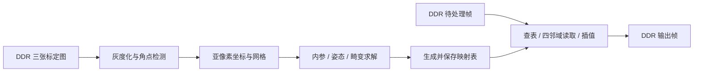

# 从 C++ 参考实现到 Verilog 模块

## 1. 边界与阅读顺序

系统边界是 **DDR 输入帧 → 处理模块 → DDR 输出帧**。MCU 如何发起任务、最终采用什么总线和 DDR 控制器，留到硬件实现时确定。摄像头到 DDR、DDR 到显示器均在本项目范围之外。

先读 `kernels/` 的单次运算，再读 `algo/` 的扫描/迭代控制，最后读本文的存储和时序约定。C++ 是浮点数值参考，当前没有逐周期模型或可直接综合的 RTL。下文的流水级是数据依赖边界，实际每级可能需要多个周期。

两类任务可以分开调度：



标定和建表按相机参数、分辨率变化触发；参数不变时，每帧只执行查表和插值。所有模块的处理器/FPGA 归属暂不固定。

## 2. 文件与模块边界

以下路径相对 `closer2fpga/` 源码目录。头文件公开输入输出，`internal.h` 只服务所属算法。

| 代码                                       | 数据任务                              | 硬件形态与状态                            |
| ------------------------------------------ | ------------------------------------- | ----------------------------------------- |
| `kernels/color.h`                        | BGR888 → gray8                       | 常系数乘加、舍入；可切流水                |
| `kernels/gradient.h`                     | Sobel、梯度外积、2×2 响应/求解       | 无历史状态的算术核；sqrt/div 不等于单周期 |
| `kernels/interpolation.h`                | 四个已读取样本 + dx/dy → 插值值      | 横向两路、纵向一路，可流水                |
| `kernels/distortion.h`                   | 理想归一化坐标 → 畸变坐标            | float/double 共用公式；可流水             |
| `algo/grayscale.cpp`                     | 按行扫描 BGR 缓冲区                   | x/y 计数器、读写握手                      |
| `algo/shi_tomasi.cpp`                    | 梯度、窗口张量、响应、全图最大值、NMS | 行缓存 + 扫描控制 + 分阶段阈值            |
| `algo/chessboard.cpp`                    | 多尺度检测和全分辨率回退              | 层级/重试状态、各层图像存储               |
| `algo/chessboard/candidates.cpp`         | 合并候选点、环形亮暗验证              | 候选点 RAM、嵌套计数器、变址读图          |
| `algo/chessboard/ordering.cpp`           | 方向搜索、排序、行选择                | 方向/排序/行搜索状态机                    |
| `algo/chessboard/validation.cpp`         | 网格代价、最小间距、精定位窗口        | 逐边/逐格遍历与归约                       |
| `algo/subpixel.cpp`                      | 局部梯度累加、求解、位置更新          | 点/迭代/窗口三级控制                      |
| `algo/calibrate.cpp`                     | 多初值和分阶段参数优化                | 标定顶层状态机                            |
| `algo/calibration/initialization.cpp`    | 归一化 DLT 与 Zhang 初值              | 外积累加、特征求解、结果判定              |
| `algo/calibration/pose_init.cpp`         | 从单应矩阵构造各图姿态                | 按视图循环、归一化/旋转运算               |
| `algo/calibration/residuals.cpp`         | 投影、畸变、残差及平方和              | 投影核可流水，代价累加有反馈              |
| `algo/calibration/lm.cpp`                | 数值雅可比、法方程、阻尼搜索          | 多层迭代状态机与矩阵 RAM                  |
| `algo/calibration/report.cpp`            | 参数转换、误差与映射有效性检查        | 归约/网格扫描、结果提交                   |
| `common/math3.*`                         | 三维点积、叉积、矩阵乘、旋转转换      | 定长运算可展开；也可复用 MAC 串行执行     |
| `common/symmetric_eigen.*`、`matrix.*` | Jacobi 特征分解、高斯消元             | 有读后写依赖的迭代运算单元                |
| `algo/remap_table.cpp`                   | 输出整数坐标 → 源浮点坐标表          | 栅格扫描 + 畸变运算流水                   |
| `algo/undistort.cpp`                     | 查表、边界、四点读取、插值、写回      | 访存控制 + 插值流水                       |
| `main.cpp`、`desktop/`                 | 文件读取、三图流程、绘制/窗口         | 桌面验证层，不是 RTL 参考计算核           |

“无历史状态”表示一次调用只依赖当前参数，并不表示浮点乘除、开方能在目标时钟内组合完成。最终可选择带寄存器的浮点 IP、定点组合逻辑或多周期共享运算器。

## 3. 已提取的复用点

- 双线性核同时供去畸变和亚像素采样调用。地址生成、边界规则在调用者，避免把随机访存写进算术单元。
- 梯度外积同时供 Shi–Tomasi 窗口和加权亚像素窗口使用。窗口累加属于控制层，不能把每点的张量和窗口总和混为同一个状态。
- Brown 畸变公式供标定残差（double）和建表（float）调用。参数字段固定为 `k1,k2,k3,p1,p2`，主流程仍默认固定 k3=0。
- 三维运算、对称特征分解、外积累加、高斯消元脱离标定流程，可独立阅读和验证。

代码复用不自动等于一个物理单元。若标定和去畸变互斥运行，可以调度同一插值/MAC/div 单元；若同时运行，必须仲裁、保存上下文，或复制资源。float 与 double 的同一模板也不意味着可直接共用同一种位宽电路。

Jacobi、法方程、消元中都存在乘加操作，适合以后共用 MAC 数据通路，但它们的寻址与数据更新顺序不同，所以当前保留各自控制代码，未强行合并成一个难读的通用循环。

## 4. 建议的流水划分

### 灰度和角点前端

1. BGR 解包 → 常系数乘法 → 求和加 500 → 除以 1000 → gray8。若用倒数乘法替代除法，应逐值验证舍入一致性。
2. 灰度行缓存产生 3×3 窗口 → Sobel 加减 → gx²/gxgy/gy² → 窗口累加 → trace/det → 开方及最小特征值。
3. 响应写入缓存，同时归约全图最大值；最大值确定后，再扫描响应做阈值筛选和 3×3 NMS。

Sobel 的边界是复制边缘，张量窗口越界梯度为零；这两种边界不能合并。3×3 Sobel 通常需要两行历史像素和横向移位寄存器；后续张量窗口、NMS 还需要各自窗口存储。

当前阈值是 `0.08 × 全图最大响应`，因此完整角点检测不是单遍逐像素流水。可保存响应后重读，也可重新计算响应，二者都是合法的存储/算力取舍。当前 C++ 保存梯度图和响应图，未实现硬件行缓存。

外积可以每个像素预计算后复用，替代 C++ 对重叠窗口的重复乘法。若改成滑动加减求窗口和，浮点累加顺序会改变，定点位宽也要容纳整个窗口，不应直接假定数值逐位相同。

### 畸变映射表

`(x,y)` → 减主点 → 除以焦距 → r²/r⁴/r⁶ → 径向系数与切向项 → 畸变归一化坐标 → 乘焦距加主点 → 写 map_x/map_y。

切点遵循上面依赖顺序；r⁴依赖 r²，r⁶依赖 r⁴。相机参数在整次任务内锁存，允许预计算 `1/fx,1/fy`，但替换直接除法后须验证误差。输出 x/y、帧标识与 valid 随流水同步延迟。

这是反向采样：遍历的是**校正后输出像素**，计算它在**畸变源图**中的位置，所以调用正向畸变公式；不需要每个像素迭代求反函数。

### 去畸变

`读映射表` → `有限值/边界检查、floor、dx/dy` → `四邻域地址` → `发读请求并收齐四点` → `横向两路插值` → `纵向插值` → `舍入饱和` → `写输出`。

四点未收齐前不能送入插值流水。多笔未完成请求要保留像素 ID、分量和 dx/dy；若允许乱序返回，需要按 ID 归并。连续 RGB 三分量共用坐标和权重，算术可以三路并行，也可复用一路并带分量计数器。

黑边模式按每个邻域样本判断越界，部分越界仍插值；不是看到负坐标就整点清零。例如 x=-0.5 仍有右侧邻域贡献。NaN/Inf 一律输出黑色；复制边缘模式先限幅。`floor` 对负数向下取整，不能改成直接截断。

归一化坐标、插值小数、像素 ID、边界掩码必须对齐。停顿时既要停数据，也要停对应元数据。边界无效像素仍应产生一个输出任务，避免行列计数错位。

## 5. 需要状态机的部分

| 控制过程    | 推荐状态顺序                                                                                 | 必须保留的上下文                           |
| ----------- | -------------------------------------------------------------------------------------------- | ------------------------------------------ |
| 帧处理      | IDLE → 锁存参数 → 扫描发请求 → 排空流水和写队列 → DONE/ERROR                             | 源/目的地址、尺寸/跨度、x/y、未完成计数    |
| 多尺度角点  | 降采样 → 子层检测 → 坐标恢复 → 原图精定位 → 必要时原图回退                               | 层号、各层尺寸和角点                       |
| 网格组织    | 方向投影 → 排序 → 行分组 → 行内选择 → 网格验证 → 更新最优                               | 方向、排序索引、行/列、最优代价            |
| 亚像素      | 取当前点 → 清累加器 → 遍历窗口/采样 → 2×2 求解 → 更新检查 → 下一轮/下一点              | 初始/当前位置、A/B 累加值、迭代数          |
| 标定        | 单应矩阵 → 内参候选 → 姿态初值 → 分阶段 LM → 选择最优 → 有效性检查                      | 当前种子、开放参数集、最好结果             |
| LM 单次迭代 | 残差 → 参数正负扰动 → 雅可比缩放 → JᵀJ/Jᵀr → 加阻尼 → 消元 → 试探残差 → 接受/增阻尼 | 当前/试探参数、矩阵、lambda、迭代/重试计数 |

当前上限和分支保留在代码中：亚像素最多 40 轮，方向搜索 -90° 到 88°、步长 2°，LM 每轮阻尼最多试探 16 次，LM 总轮数来自配置。检测候选过多、退化矩阵、出界、未收敛等退出条件都属于有效控制逻辑，不能作为“软件补丁”删除。

LM 的默认三视图、每图 40 点、k3 固定时，共 26 个活动参数和 240 个残差分量。double 雅可比为 240×26×8 = 49,920 字节，法方程为 26×26×8 = 5,408 字节，另有残差、试探矩阵等缓冲。总内存不是这两项之和就足够；当前代码还为每次试探分配临时对象，RTL 应按生命周期规划 RAM。

累加器存在反馈延迟。若浮点加法延迟多拍，连续向同一累加器每拍提交新值会产生依赖；可交织多个独立累加器后归约，或降低启动频率。消元每个主元和 Jacobi 每次旋转依赖上次写回，也不能无条件展开成每拍独立迭代。

## 6. DDR 缓冲区约定

`common/image_view.h` 提供不拥有内存的视图：`data,w,h,c,stride`。stride 单位为**元素**：uint8_t 图像是字节，float 映射表是 float 个数。地址为 `base + (y*stride + x*c + channel)*sizeof(T)`。

`convert_grayscale` 和借用缓冲区版 `remap_bilinear` 不分配输出内存，支持行末 padding，且不改 padding。输出不得与输入或映射表重叠，接口在执行前检查。原来的拥有内存版 remap 保留临时输出，仍支持同一个 Image 作输入输出。

```cpp
// 指针来自 CPU 可访问的帧缓冲区；不能把物理 DDR 地址直接强转后使用。
ImageView<const uint8_t> src{src_ptr, width, height, 3, src_stride_bytes};
ImageView<uint8_t> dst{dst_ptr, width, height, 3, dst_stride_bytes};
const RemapTable& map = table;
remap_bilinear(src, image_view(map.map_x), image_view(map.map_y),
               dst, RemapBorder::ConstantBlack);
```

调用者负责实际存储容量、指针生命周期和可见性；接口只能检查描述符和跨度，不能判断一段指针背后的真实 DDR 分配大小。角点阶段仍用拥有内存的连续灰度图和中间图；尚未将所有算法改成 DDR 流或片上 RAM。

以 1280×720、无 padding 为例：一张 BGR888 图 2,764,800 字节，输入输出各一张；float 双坐标表 7,372,800 字节。若每个输出从 DDR 读 8 字节映射、四个 3 字节像素并写 3 字节，则理论有效载荷为 23 字节/像素，即每帧 21,196,800 字节。该数值未含突发对齐/重复取数/总线开销，也未扣除缓存复用，不能直接当作实际 DDR 带宽。在线建表可省查表带宽，代价是每帧运行畸变核。

源坐标是非顺序访问。两行缓存不足以普遍保证去畸变所需邻域仍在缓存中；后续根据映射跨度选择行缓存、块缓存或直接 DDR 访问。映射表按输出扫描可顺序读取，源像素读写策略应独立设计。
