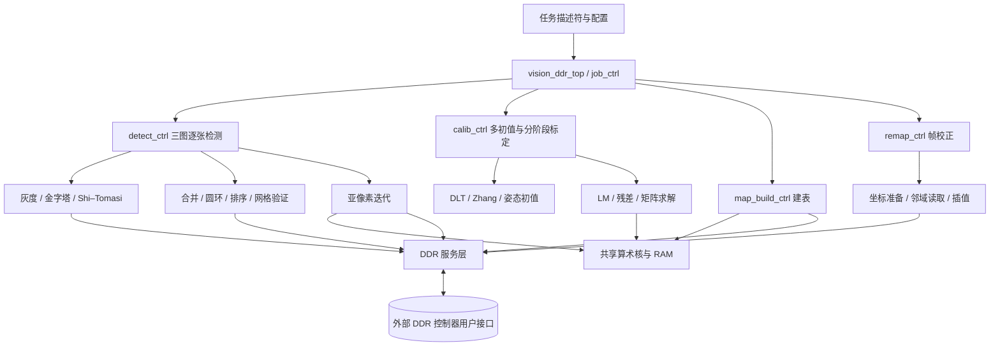

# DDR 到 DDR 的 Verilog 分层设计规划

**完整目标：从 DDR 读取三张已解码的标定图，在 FPGA 内完成角点检测、标定和映射表生成；此后从 DDR 读取待校正图像，把去畸变结果写回 DDR。** 外部控制端只配置任务、管理缓冲区和读取状态。

阅读顺序：第 1～4 节看整体和接口；第 5～8 节用于逐模块实现；第 9～11 节用于存储、数值和验证；第 12 节是开发顺序，最后第 13 节是文件清单。

## 1. 系统边界与首版约束

### 1.1 输入、输出和运行方式

| 项目       | 本设计约定                                                               |
| ---------- | ------------------------------------------------------------------------ |
| 标定输入   | DDR 内三张同尺寸 BGR888 图，棋盘 5 行 × 8 列内角点                      |
| 帧处理输入 | DDR 内一张 BGR888 图，或配置为 Gray8；图像已解码                         |
| 图像输出   | DDR 内同尺寸、同通道排列的去畸变图；首版输出内参等于输入内参             |
| 其他结果   | DDR 内有序角点、相机参数、各视图姿态和误差报告；映射表也保存在 DDR       |
| 坐标约定   | 左上像素中心为`(0,0)`，x 向右、y 向下；角点和映射使用像素坐标          |
| DDR 边界   | 算法顶层对接 DDR 控制器的用户侧事务接口；板级 DDR PHY 和控制器由工程集成 |
| 任务并发   | 首版标定、建表、帧处理互斥；同一时刻只执行一个顶层任务                   |
| 参数规模   | 首版固定三视图、40 点、k3=0；保留 27 个状态槽，最多 26 个活动参数        |
| 图像规模   | `MAX_W/MAX_H` 为综合参数，实际 W/H 为任务参数，超范围直接拒绝          |

C++ 接口支持更广泛的图像/棋盘/视图规模；首版固定上述规模是明确的硬件范围收缩。更改规模必须同步扩展 RAM、计数器、报告布局和回归测试，不能只改一个寄存器。

建议支持四个任务码：

| 任务          | 执行内容                               | 完成后产生什么                 |
| ------------- | -------------------------------------- | ------------------------------ |
| `CALIBRATE` | 三图读入→检测→联合标定→检查→建表   | 角点、参数、报告、有效映射表   |
| `BUILD_MAP` | 从 DDR 参数记录加载有效参数→建表      | 新映射表及版本信息             |
| `REMAP`     | 读指定输入帧与有效映射表→插值→写图   | 一张输出图                     |
| `FULL_RUN`  | 执行 CALIBRATE，再依次校正三张标定原图 | 与当前桌面三图主流程对应的结果 |

正常视频处理反复执行 REMAP，不重复标定。CALIBRATE 失败时仍写失败报告，但不发布新参数或新表。保留旧表不等于允许本次 FULL_RUN 静默使用旧表。

### 1.2 不应该做成单条流水线的原因

灰度、Sobel、映射和插值适合像素流水；全图阈值需要帧级屏障；候选合并和网格排序处理变长点集；亚像素和 LM 有前后依赖的迭代。因此架构采用“任务控制器 + 若干阶段控制器 + 共享算术核 + 显式存储”。长循环由局部控制器负责，不塞进一个巨大的顶层 always 块。

## 2. 模块层级与数据流



| 层级             | 负责什么                                           | 不应包含什么                 |
| ---------------- | -------------------------------------------------- | ---------------------------- |
| L0：任务层       | 锁存配置、调度阶段、管理表版本、结果提交、错误收尾 | 像素公式、矩阵内层循环       |
| L1：算法阶段层   | 检测、标定、建表、校正各自的完整流程               | 具体 DDR 总线时序            |
| L2：循环与缓存层 | 图像扫描、窗口、候选 RAM、排序、迭代、矩阵寻址     | 板级 IO、DDR 引脚控制        |
| L3：算术层       | Sobel、外积、插值、畸变、浮点/特殊函数等           | 图像地址、任务策略、重试上限 |
| 横向基础层       | FIFO、RAM、事务仲裁、读写 DMA、字节打包、时钟跨域  | 算法阈值和标定策略           |

所有 L1 模块输出阶段统计，如当前视图、层级、点号、迭代号。顶层只观察阶段状态，不直接修改其内部计数器。

## 3. 先固定接口契约

### 3.1 阶段命令与像素流

阶段命令统一使用 `cmd_valid/cmd_ready`；只在二者同时为 1 时锁存命令。完成用 `rsp_valid/rsp_ready` 携带 `status/job_id`；接收完成前保持响应稳定。一个阶段首版只允许一个在途命令。`busy` 表示已接收任务且尚未被消费完成响应。

像素或算术流使用 `in_valid/in_ready/in_data` 和 `out_valid/out_ready/out_data`。只有 `valid && ready` 才能推进对应计数器。`valid && !ready` 时数据及元数据必须保持不变。数据包携带 `pixel_id`，必要时带 `view_id/level_id/channel/mask`；不能只延迟数值而丢掉标签。

若浮点 IP 不能停顿，入口必须为已经接收的运算预留出口空间，或用足够深的 FIFO 吸收全部在途结果；不能把下游 ready 直接接到一个不支持停顿的 IP。延迟和启动间隔分别记录为 `LATENCY/II`，不能假定“延迟十拍”就必然“每十拍才能接收”。

### 3.2 DDR 服务接口

建议算法层只看到以下抽象事务，具体 AXI 或控制器原生口在 `ddr_port_adapter` 中适配。所有地址和长度统一为**字节**。

| 通道   | 主要字段                                                  | 完成语义                                       |
| ------ | --------------------------------------------------------- | ---------------------------------------------- |
| 读命令 | `addr, len_bytes, client_id, tag` + valid/ready         | 命令接受不代表数据到达                         |
| 读返回 | `data, keep, last, client_id, tag, error` + valid/ready | last 标记该命令最后一个有效数据拍              |
| 写命令 | `addr, len_bytes, client_id, tag` + valid/ready         | 接受后仍须传数据                               |
| 写数据 | `data, keep, last` + valid/ready                        | 与被接受的写命令绑定；首版不交织写数据         |
| 写完成 | `client_id, tag, error` + valid/ready                   | 控制器确认该笔写事务完成，不是 FIFO 已收下数据 |

首版适配器可限制一次一笔读、一笔写在途，以降低实现难度；接口保留 tag 便于以后扩展。增加多在途或乱序返回时必须有路由表和重排/归并 RAM。客户端不得通过“返回第几拍”猜测来自哪一个像素。

`raster_dma` 按行拆请求：起点 `base+y*stride_bytes`，长度 `W*C`。`ddr_port_adapter` 负责控制器要求的对齐、最大突发长度及边界拆分。BGR888 的一个像素可能跨总线字，`byte_packer` 必须跨拍重组。行末只写 `W*C` 字节，padding 不变；若控制器不能直接表达尾字节使能，由适配层实现受控读改写，并保证该字没有其他写入者。

### 3.3 配置描述符与检查

建议用配置寄存器锁存一份任务描述符，或者先从 DDR 读取描述符到寄存器。具体寄存器总线不属于算法，字段和含义必须固定：

| 字段组    | 必需内容                                                                                                |
| --------- | ------------------------------------------------------------------------------------------------------- |
| 标识      | `abi_version, job_id, opcode`                                                                         |
| 图像      | W、H、C，三张标定图 base/stride，待处理图 src_base/stride 和 dst_base/stride；FULL_RUN 的三个目的描述符 |
| 工作区    | `scratch_base, scratch_size_bytes`，各层/响应/候选溢出存储由内部布局计算                              |
| 映射      | `map_x_base, map_y_base, map_stride_bytes, map_version`；首版两个 FP32 平面                           |
| 参数/报告 | `params_base, corners_base, report_base` 及各缓冲区容量                                               |
| 算法选项  | border 模式、LM 每阶段上限（默认 150）、square_size（默认 1）                                           |

预检查包括：W/H/C 支持范围、stride≥有效行字节数、地址加法无溢出、容量足够、输入/输出/映射/工作区不发生危险重叠、表版本和尺寸匹配、DDR ready。地址末端用扩展一位的算术检查，不允许高位被截断后误判合法。所有配置在任务内保持不变。

CPU 缓存可见性和缓冲区所有权属于集成契约：启动前输入对 DDR 可见；busy 期间外部不改输入/参数/表；输出完成后才由外部接管。读写完成保证到控制器约定的可见性边界，不能凭 RTL 的 done 推断 CPU 缓存已经自动失效。

## 4. 顶层任务控制器

`job_ctrl` 的宏观职责是让完整任务“有起点、有完成、有失败路径”，并防止半成品被使用。

```text
IDLE → LATCH → CHECK
  CALIBRATE/FULL_RUN:
    LOAD_VIEW → GRAY/PYRAMID → DETECT → SAVE_CORNERS
    → 下一视图（共三张）→ CALIBRATE → VALIDATE → BUILD_MAP
    → [FULL_RUN: REMAP_VIEW，循环三张]
  BUILD_MAP: LOAD_PARAMS → VALIDATE_PARAMS → BUILD_MAP
  REMAP: CHECK_MAP → REMAP_FRAME
→ DRAIN → WRITE_REPORT → WAIT_REPORT_ACK → PUBLISH → RESPONSE

任一硬错误 → STOP_ISSUE → DRAIN_OR_RECOVER → WRITE_ERROR_REPORT → RESPONSE
```

每个箭头跨阶段时等待子模块响应，以及该阶段依赖的 DDR 写完成。例如响应图尚在写队列时不能启动 NMS 重读；map_x 写完但 map_y 未写完不能发布新表。

建议维护 `accepted_reads, completed_reads, accepted_writes, completed_writes` 或等价未完成计数，以及每个引擎的 `empty`。成功退出要求所有目标数据写完成、计算流水和队列排空、无访存错误。`done` 不是“最后一个像素已送进写 FIFO”。

报告按 `job_id` 识别，busy 期间不可当作新报告。先写报告主体，再写最终提交标记，等标记写完成后才给出任务完成。失败的输出图可能已有部分内容，报告的 `output_valid=0`，外部不得显示或复用为有效结果。

新参数和映射写入备用缓冲区，成功后原子切换有效描述符；若只配置单表缓冲区，建表开始即将它标成无效，不能承诺失败后仍保留旧表。复位清除控制有效位与缓存标签；在途 DDR 事务须先排空，或由系统协调复位适配器与控制器，禁止直接复用旧 tag。

错误分为可恢复算法分支与硬错误：某尺度失败可回退、某 seed 失败可继续；所有尺度失败、三图任一无棋盘、最终参数无效才终止标定。DDR 错误、容量不足、地址错误直接终止任务。无响应的 DDR 超时需要外部恢复接口，不能假装已经安全排空。

## 5. 检测子系统：DDR 图像变成有序角点

### 5.1 `gray_scan` 与 `pyramid_ctrl`

`gray_scan` 负责顺序读取 BGR 字节，调用 `bgr_to_gray`，顺序写 Gray8 工作图。公式为 `(299*R+587*G+114*B+500)/1000`，整数除法取商；C=1 时直接复制。x/y 只在像素交付后推进，读和写可通过 FIFO 重叠。

`pyramid_ctrl` 管理缩图和尺度回退。当前算法在 W/H≥32 且 `max(W,H)>960` 时递归减半：`half_w=floor(W/2)`、`half_h=floor(H/2)`，四像素求和加 2 后除以 4，奇数末行/列不参与缩图。

硬件用有限深度层描述符栈替代递归，保存 `{base,W,H,stride,level}`：先生成到终止层，在最小层执行 native 检测。成功则向上恢复 `p_parent=2*p_child+0.5` 并调用 `grid_refine_ctrl`；该层精定位/验证失败，或子层检测失败，都转为该层 native 检测，再向上一层返回。最终必须得到第 0 层坐标。不能只做“缩图失败后直接跳原图”，否则多层大图与当前代码不同。

### 5.2 `shi_tomasi_ctrl`：明确两遍扫描

| 子模块                 | 输入→输出                | 实现方法与内部状态                                                |
| ---------------------- | ------------------------- | ----------------------------------------------------------------- |
| `window3x3`          | 灰度流→3×3 灰度窗       | 两行历史 RAM、横向寄存器，扫描边界复制；含首尾行列补齐控制        |
| `sobel_core`         | 灰度窗→gx/gy             | 加减与移位；算术流水，不管理图像地址                              |
| `tensor_core`        | gx/gy→xx/xy/yy           | 三个乘积；这里不做窗口累加                                        |
| `tensor_window_sum`  | 外积流→3×3 张量和 A/B/C | 三路窗口缓存；图外梯度按零处理                                    |
| `min_eigen_core`     | A/B/C→响应 R             | `trace=A+C; det=A*C-B*B; R=(trace-sqrt(max(0,trace²-4det)))/2` |
| `response_store_max` | R→DDR 响应图及 Rmax      | 顺序写 FP32 响应，同时求最大值                                    |
| `nms_candidates`     | 响应图/Rmax→候选坐标     | 重读响应、3×3 NMS、顺序写候选 RAM                                |

控制顺序：`CLEAR_MAX → RESPONSE_PASS → DRAIN_WRITE → CHECK_MAX → NMS_PASS → COUNT_CHECK → DONE`。Rmax 非有限或≤0 则无候选。阈值固定为 `0.08*Rmax`，保留 R>0 且 R≥阈值；仅当邻居严格大于中心才抑制，因此相等的平台点仍会留下。默认张量窗 3×3，NMS 扫描 `x∈[2,W-3]、y∈[2,H-3]`。

边界有两套规则：Sobel 灰度窗复制边缘；张量窗图外贡献为零。它们不能共用一个含糊的 padding 开关。填充行/列期间控制器可产生内部扫描拍，但不能把它们当成真正图像输出计数。

候选按 y 优先、x 次之的光栅顺序存储。原生检测在候选少于 40 或大于 12000 时失败。首版应支持 `MAX_CANDIDATES=12000`，第 12001 点触发本尺度失败；如果器件限制导致降低容量，必须把它作为能力限制报告，不能静默截断或擅自只保留前 K 点。

### 5.3 `candidate_filter_ctrl`：去重、精定位和圆环筛选

阶段顺序必须保留：`MERGE(radius=5) → SUBPIXEL(radius=7) → MERGE(radius=3) → NEAREST → RING_FILTER`。使用候选 A/B 两组存储，当前列表只读，结果列表顺序写，阶段结束后换角色。

**去重控制 `candidate_merge`**：外循环 i 找未使用点，保存固定锚点 `points[i]`；内循环 j=i+1…N-1，若 j 未使用且到锚点距离<radius，置 used[j] 并累加其坐标。最后输出均值。注意代码不是连通域聚类，也不是到“不断变化的均值”判断距离；改变这点会改变后续点集。复杂度 O(N²)，用两层计数器和距离核复用实现。

**最近邻 `nearest_spacing`**：每个点扫描所有其他点，取最小欧氏距离；半径 `clamp(0.22*spacing,4,18)`。可先比较距离平方，最终只开方一次，但近阈值数值差异要验证。

**圆环 `ring_check`**：按 k=0…31 用正余弦 ROM 产生偏移，坐标按 C++ lround 规则取最近整数，读 32 个灰度样本。对循环邻居做 `[1,2,1]/4` 平滑，求 hi/lo；以 `(hi+lo)/2` 分二值扇区，统计环形切换次数、相对点差和四段长度。

判定必须同时满足：对比度≥20、切换恰好 4 次、相对亮度差总和≤`32*(hi-lo)*0.28`、每段长度 3～13。越过采样安全边界直接失败。基本半径通过后，0.75 倍半径或 1.25 倍半径至少一次通过，才输出此点；保留短路顺序以减少读取。32 个值和 32 个平滑值可用小寄存器组。

### 5.4 `grid_order_ctrl`：散点组织为 5×8

宏观职责是搜索网格排列，不生成新角点。输入是筛选后的点列表，输出是 40 个原始测量坐标的索引。

```text
角度 degree=-90,-88,…,88（90 个方向）
  → 所有点投影到 u/v（sin/cos ROM）
  → 按 v 排索引
  → 求相邻 v 间隙，选最大的 rows-1 个，再按位置排序作为行边界
  → 对每行按 u 排索引
  → 枚举该行每个连续 cols 点窗口
      求 cols-1 个距离、中位数、间距相对偏差平方和
      中位间距<4 则跳过；保留最小行代价窗口
  → 拼接完整网格，调用 grid_validate
  → 严格更小的有效代价才覆盖全局 best
→ 统一原点/行列方向 → 输出 best 或失败
```

候选很多时不建议全用插入排序。`index_sort` 首版采用双 RAM 的迭代归并排序：run_len 从 1 倍增，读两有序段、比较并输出到另一 RAM，最后交换 RAM；保存 run 起点和两个读指针。行间隙选择只需保留最大的四项；行内 7 个距离的中位数可复用小排序器。排序搬索引及 key，不搬图像。

C++ 的 `std::sort` 未约定相等 key 的次序。RTL 规定相同 key 按原点索引升序；导出的硬件参考模型也用该规则。不能声称退化平局输入必定与原 C++ 完全相同。

全局最佳排列确定后，在四个端角中选 x+y 最小者作为原点，根据所选端角反转行/列。坐标保留为图像测量值，不把投影坐标作为标定输入。

### 5.5 `grid_validate` 与 `grid_refine_ctrl`

`grid_validate` 顺序访问每个点的横/纵连续边和每个小格，累加代价。早期失败直接返回 invalid，不必算完整张网格：

| 检查   | 当前判定                                                                |
| ------ | ----------------------------------------------------------------------- |
| 连续边 | 两条边长都≥4；比值在 [0.55,1.8]；夹角余弦≥0.90                        |
| 边代价 | 累加`(1-cosine)+log(l2/l1)²`，因此需要 log 运算服务                  |
| 单格   | 四个相邻边转角的长度乘积≥16，绝对叉积≥乘积×0.2，且全网格转向符号一致 |

`grid_refine_ctrl` 先遍历所有横/纵相邻点求最短边，然后以 `clamp(int(min_step*0.15),2,10)` 为半窗调用亚像素模块，再次验证网格。native 检测以及每次尺度恢复都调用它。验证失败时清空有效角点；这里不能以“已经找到 40 点”代替质量判断。

## 6. 亚像素模块：每个点内部还有迭代

`subpixel_ctrl` 输入灰度图描述符、点列表和 radius，输出同样顺序的点列表及逐点是否收敛。它同时服务初始候选和最终 40 点。radius 先限制到 [2,15]；图像不足 `2*radius+5` 时整个操作保留输入。

### 6.1 数据通路

建议用 `patch_reader` 将当前点周围的整数灰度矩形读到片上 patch RAM。每个窗口位置需要在 `(sx±1,sy)`、`(sx,sy±1)` 双线性取样，再做中心差分 gx/gy。包含差分与双线性右下邻域时，对当前 floor(p) 从 `-radius-1` 到 `+radius+2` 的范围已经足够，最大 34×34 字节。每轮 p 变化后重新检查/装入 patch；首版每轮重读，后续再做复用。

高斯权重 `exp(-(x²+y²)/radius²)` 只依赖整数窗口偏移和 radius，可离线生成 ROM，覆盖 radius=2…15。`bilinear_core` 输出浮点样本给亚像素使用，不执行 uint8 舍入；图像输出的舍入由独立模块负责。

对窗口内每个偏移 `(x,y)` 累加：

```text
xx=w*gx², xy=w*gx*gy, yy=w*gy²
a+=xx; b+=xy; c+=yy
bx+=xx*x+xy*y; by+=xy*x+yy*y
det=a*c-b²; trace=a+c
dx=(c*bx-b*by)/det; dy=(a*by-b*bx)/det
```

### 6.2 状态与退出

```text
LOAD_POINT（original=p）→ CHECK_BOUND → LOAD_PATCH → CLEAR_SUM
→ WINDOW_SAMPLE → GRADIENT_WEIGHT → ACCUMULATE → 下一窗口位置
→ SOLVE_2X2 → CHECK_UPDATE
  小步收敛：COMMIT_POINT → 下一点
  未收敛且未达上限：p=next，iter++ → CHECK_BOUND
  不可靠或满 40 轮：RESTORE_ORIGINAL → 下一点
```

点非有限、窗口出界、`trace<1e-8` 或 `det≤1e-5*trace²`、新位置非有限、离 original 距离>radius，都不更新最终输出。只有 `dx²+dy²<1e-6` 才置可靠并提交；满 40 轮仍没收敛也恢复 original。有效窗口中心要求 `p.x≥radius+1`、`p.x<W-radius-2`，y 同理。

这里有三层循环：点号、迭代号、窗口 y/x；读图还包含行号/字节号。分别用寄存器保存，不能在等待 DDR 或浮点结果时推进上层循环。五个 FP64 累加器有反馈依赖，首版等待加法写回再消费下一个样本；后续交织累加器优化须评估累加顺序变化。

## 7. 标定子系统：有序角点变成相机参数

### 7.1 `calib_ctrl`：初始化、种子和阶段

输入为三组 40 点和图像尺寸，图像本身不再参与这个阶段。角点 RAM 在整个标定任务期间只读。初始检查包括点数、有限值及坐标范围。

```text
每视图 HOMOGRAPHY → CHECK_DIVERSITY → ZHANG
→ 构造种子列表（有效 Zhang 初值 + 四组固定初值）
→ 每个 seed:
    POSE_INIT（失败则下一 seed）
    → LM_STAGE0（22 活动参数）
    → LM_STAGE1（23 活动参数）
    → LM_STAGE2（26 活动参数）
    → EVALUATE_FINAL → UPDATE_BEST → 下一 seed
→ FINISH_REPORT → CHECK_CAMERA → 输出参数/失败
```

四组固定焦距种子为 `fx=fy=W*{0.6,1.0,1.8,3.0}`，主点 `((W-1)/2,(H-1)/2)`；加上 Zhang 最多五组。所有 H 与第一张 H 前八个元素的绝对差总和<1e-6 时认为重复视图，终止。

参数状态总长度 27，布局必须与源码一致：

| 索引              | 内部含义                                 |
| ----------------- | ---------------------------------------- |
| 0、1              | log(fx)、log(fy)                         |
| 2、3              | cx/W、cy/H                               |
| 4、5、6、7、8     | k1、k2、p1、p2、k3                       |
| 9+6*v … 14+6*v | 视图 v 的旋转向量三分量、tx、ty、log(tz) |

stage0 活动索引为 `{0,1,2,3,9…26}`，stage1 在其后增加 4，stage2 再增加 5、6、7。k3 槽存在但首版恒为零。`active_index` ROM/RAM 保存顺序，J 的列号不是完整参数索引。状态字段顺序与 Brown 模型 `{k1,k2,k3,p1,p2}` 不同，调用时显式映射。

每阶段最多 150 轮，**不是整次标定共 150 轮**。当前代码前两阶段不收敛也继续后续阶段；最终阶段返回值作为该 seed 的 converged。按最终 cost 严格最小选择 best，再验证其 converged；不能改成先过滤不收敛种子再选最小代价而仍声称等价。`iterations` 报告的是该 seed 各阶段接受更新的总次数，另设调试计数记录尝试次数。

### 7.2 `homography_init`：归一化 DLT

宏观职责：每张图的 40 组对应点变成一个 H。对象点先采用以棋盘中心为原点的单位格坐标 `(c-(cols-1)/2,r-(rows-1)/2)`，不是直接用毫米坐标。

实现分为五遍小数据处理：求图像点均值；求图像点/对象点到中心的平均距离；生成归一化点；每点形成两条 9 元 DLT 行并累加 9×9 的 AᵀA；调用 `jacobi_eigen`，取最小特征值对应向量，反归一化并除以 H[8]。

保留 `view/point/row_component/matrix_i/matrix_j` 计数器。81 个 FP64 元素存 RAM，顺序 MAC 复用即可。图像/对象距离总和<1e-6、特征求解不收敛、排序后 `eval[1]<eval[8]*1e-10` 或 `abs(H[8])<1e-12` 均失败；不能只检查 H[8]。

### 7.3 `zhang_init` 与 `pose_init`

`zhang_init` 对各 H 先做源码规定的图像归一化，构造两条六元素约束 `v12` 与 `v11-v22`，累加 6×6 矩阵，复用 Jacobi 求最小特征向量。检查正定相关分母、lambda 和内参范围，得到内参种子。失败只代表不添加 Zhang 种子，仍尝试固定种子。实现时逐条迁移 `initialization.cpp` 的归一化矩阵和检查，不能省略归一化后直接使用像素尺度矩阵。

`pose_init` 对每视图计算 K⁻¹H 的列，求尺度、根据深度修正符号、对前两旋转列做正交化，叉乘得第三列。`rotation_convert` 用四元数分支把旋转矩阵变成旋转向量，保留接近 π 的稳定分支；不能一律除以 sin(theta)。写内部状态时对焦距和 tz 取 log，深度必须>0。

`math3_seq` 用循环 MAC 实现 3×3 矩阵乘、点积和叉积；`rotation_convert` 负责 Rodrigues 正向及四元数反向转换；共享算术服务需提供 sqrt、div、sin/cos、atan2、exp/log，报告的姿态角还需要 acos，或有验证过的等价判定实现。

### 7.4 `residual_engine`：标定反复调用的预测核

输入一份完整状态，输出 240 个 FP64 残差及 cost。每次调用先检查状态有限性，算 fx/fy、cx/cy；每视图只计算一次 R 和 tz，然后扫描 40 个棋盘点：

```text
中心化对象点 X/Y → R/t 变换 → 除以 Z 得 nx/ny
→ brown_distort(FP64) → fx/fy/cx/cy 还原像素
→ 减观测值，输出 du/dv → 累加 du²+dv²
```

焦距不在 [1e-3,1e7] 或任一点 Z≤1e-5、结果非有限时返回 invalid cost。残差顺序 `2*(view*40+point)+component`，cost 是两分量平方和，RMS 分母则是 120 个角点。每次候选状态变化都要重新解码旋转和指数，不能误用上一状态的缓存。

### 7.5 `lm_ctrl`：把优化拆成可追踪的循环

建议模块划分：`jacobian_engine` 生成/缩放 J；`normal_equation_engine` 计算 N、g；`gauss_solver` 解试探步；`lm_ctrl` 只控制当前/试探状态、lambda 和接受条件。

```text
STAGE_START: lambda=1e-3，计算 r(p)/cost
ITER_BEGIN:
  cost<1e-16 → CONVERGED
  每个活动参数 k:
    h=1e-6*(1+abs(p[active[k]]))
    → residual(p+h) → residual(p-h)
    → J[:,k]=(r_plus-r_minus)/(2*h)
    → scale[k]=1/max(sqrt(sum(J[:,k]²)),1e-12)
    → 重扫此列，乘 scale[k]
  → N=JᵀJ，g=Jᵀr
  → 检查最大绝对梯度
  → 最多 16 次 damping attempt:
       从不可变 N 复制 A，A 对角加 lambda，b=-g
       → GAUSS_SOLVE → q=p+delta*scale
       → residual(q)/new_cost
       → 接受：提交 q/r_trial/cost，lambda=max(0.3*lambda,1e-12)
       → 拒绝/消元失败：lambda*=10，下一 attempt
  → 接受且未收敛：下一外迭代；否则按退出条件返回
```

必须保存 `p_current/p_trial/p_best` 三份状态；trial 失败绝不覆盖 current。阻尼重试复用本轮 J、N、g，不重新算雅可比，也不能在已被高斯消元破坏的 A 上继续加阻尼。每次新阶段 lambda 重新置 1e-3。

| 检查位置           | 与当前代码对应的退出条件                                 |
| ------------------ | -------------------------------------------------------- |
| 初始或正负扰动残差 | 非有限即本阶段不收敛返回                                 |
| 法方程后           | `max_abs(g)<1e-8*(1+sqrt(cost))` 则收敛                |
| 接受试探           | 仅`new_cost<cost` 接受；等值不接受                     |
| 接受后的终止       | 最大相对参数步长<1e-9，或 reduction<`1e-11*(1+新cost)` |
| 16 次都未接受      | 只有`max_abs(g)<1e-5*(1+sqrt(cost))` 才算收敛          |
| 用尽阶段外迭代     | 返回未收敛；已接受的 current 仍保留给后续阶段            |

硬件另检测运算器异常和 lambda 溢出，输出诊断码。这属于实现保护，不要把它记录成正常算法收敛。

J 采用行优先 `J[t*MAX_ACTIVE+k]` RAM 布局；生成一列时跨行写，法方程按行读取。每个 J 列须先算完范数才能缩放，不是残差一出来就直接累加最终 N。首版保留完整 J 以便调试，优化掉 J 属于后续重设计。

### 7.6 两个矩阵求解器的控制细节

**`jacobi_eigen`**：配置 n=9 或 6，A/V 分别存 RAM，V 初始单位阵。每轮扫描上三角找最大非对角绝对值，并归约最大对角绝对值；满足 `largest≤1e-14*max(diagonal,1e-30)` 则结束。否则算旋转角 `0.5*atan2(2*A[p,q],A[q,q]-A[p,p])`，更新 A 两行/列和 V 两列。先锁存每对旧值再写两个新值，更新全部写回后才能寻找下一主元。最多 `100*n*n` 次旋转搜索轮：n=9 为 8100，n=6 为 3600。结束后按特征值排序并同步重排特征向量列。

**`gauss_solver`**：输入 n×n A 与 b，复制到 n×(n+1) 增广 RAM。每列先选下方最大绝对主元，求该候选行的剩余列尺度，必要时交换行；锁存 factor 后遍历列做消元；一列全部写回后才能进入下一列。正向消元完，从末行向上回代。

保留源码相对主元检查 `row_scale<1e-30` 或 `max_pivot<row_scale*1e-14`，以及主元/因子/解的有限性检查。返回 `solve_ok=0` 让 LM 加阻尼重试。RAM 的同步读延迟和同址读写语义要写进控制器，不依赖仿真数组“看起来立即读到”。

### 7.7 `calib_validate` 与结果提交

最佳状态先转换为 CameraParams 的 FP32 参数，计算总 RMS、各视图 RMS、最大点误差和姿态。输出姿态的平移要从内部棋盘中心恢复到第一个内角点原点，再乘 square_size；该量只影响平移报告，不影响像素映射。

有效条件沿用当前代码：最终阶段收敛；fx/fy 在 `(0.05W,20W)`；主点位于图内；RMS<3 像素；视图法向最大夹角>0.01 弧度；33×25 个采样位置上映射雅可比满足 a>0、d>0、`a*d-b²>1e-4` 且有限。

`weak_geometry` 为法向夹角<0.17 或视图数<5；三视图首版总会置这个提示位，**它本身不等于参数无效**。雅可比采样检查属于当前的有限采样判据，不是对每个连续坐标无翻折的数学证明。检查失败只提交诊断报告，不启动建表。

## 8. 建表与帧校正子系统

### 8.1 `map_build_ctrl` 与 `map_coord_core`

`map_build_ctrl` 顺序生成输出 x/y，调用坐标核，把 sx/sy 分别写到 FP32 的 map_x/map_y 平面。调用前锁存本次相机参数，标签携带 `pixel_id=y*W+x`。

```text
nx=(x-cx)/fx, ny=(y-cy)/fy
r2=nx²+ny²; r4=r2²; r6=r4*r2
radial=1+k1*r2+k2*r4+k3*r6
xd=nx*radial+2*p1*nx*ny+p2*(r2+2*nx²)
yd=ny*radial+p1*(r2+2*ny²)+2*p2*nx*ny
sx=fx*xd+cx; sy=fy*yd+cy
```

此处遍历理想输出位置、计算畸变源坐标，**没有每像素反解畸变的迭代**。首版采用与 C++ 相同的 FP32 运算类型；预计算 1/fx、1/fy 替代除法是后续可验证优化。

控制为 `LOAD_PARAMS → RASTER_ISSUE → DRAIN_MATH → DRAIN_MAP_WRITES → COMMIT_MAP`。两个平面都收到全部写确认后才置 map_valid，并绑定相机参数版本、W/H 和像素坐标约定。

### 8.2 `remap_ctrl`：顺序输出、非顺序输入

| 模块               | 宏观职责               | 关键实现                                              |
| ------------------ | ---------------------- | ----------------------------------------------------- |
| `map_reader`     | 按输出光栅读 sx/sy     | 双平面顺序读、按 pixel_id 配对；预取 FIFO             |
| `sample_coord`   | 生成整数邻域与小数权重 | 有限值检查、border 处理、floor、dx/dy、四位有效掩码   |
| `neighbor_fetch` | 收集四个 BGR/Gray 样本 | 生成字节地址，请求/返回归并；无效样本就地补零         |
| `pixel_cache`    | 减少源图随机 DDR 访问  | 按字节块的只读缓存，miss 填充后重试，任务切换失效标签 |
| `bilinear_core`  | 四点+dx/dy→浮点像素值 | 先两路横向插值，再纵向；无地址逻辑                    |
| `pixel_round`    | 浮点值→输出分量       | 对非负值按最近整数舍入并饱和到 [0,255]                |
| `output_writer`  | 连续像素写到目的图     | 光栅顺序打包、行尾 byte enable、等待写响应            |

首版 `neighbor_fetch` 一次只处理一个像素任务：锁存 id/dx/dy/mask，依次读齐最多四个像素（每个包含全部通道），然后送插值；这个版本便于验证但吞吐有限。优化版维护 K 个槽，每槽存 4 个收齐标志、权重、样本、job/pixel_id；按 tag 回填，全部到齐才就绪；若计算先后变化，用输出重排队列恢复光栅顺序。

缓存建议从可旁路的小型直接映射字节块缓存开始。块大小为可配置的总线拍整数倍；首版 blocking miss，一次只填一个块，命中后由字节偏移提取分量。像素跨块时拆两次读，访问图尾时限制填充范围，不能因为预取读出分配的缓冲区。若希望整块填充，需要在描述符容量中明确额外可读 padding。两行缓存不足以保证任意去畸变映射的取数范围。

### 8.3 边界与一个具体处理例子

黑边模式：非有限 sx/sy 输出黑；`sx≤-1`、`sy≤-1`、`sx≥W` 或 `sy≥H` 整点黑；其他情况下先 floor，四个邻域分别判越界并补零。复制边缘模式先将有限坐标限幅到 `[0,W-1]×[0,H-1]`，再对邻域索引限幅。无效图外地址不得发送到 DDR。

例如 sx=-0.5、sy=10.25：ix=-1、iy=10，dx=0.5、dy=0.25，左侧两点补零，右侧两点读取 `(0,10)` 与 `(0,11)`。最终仍会有图内颜色贡献；直接因为 sx<0 输出黑是错误的。floor(-0.5)=-1，不能用向零截断得到 0。

对通道 c，按当前 `kernels/interpolation.h` 计算 `top=(1-dx)*p00+dx*p10`、`bottom=(1-dx)*p01+dx*p11`、`value=(1-dy)*top+dy*bottom`。代数等价的差分插值形式可能改变浮点舍入，作为后续优化单独验证。三个 BGR 分量共用权重，可复用一条算术通道并用 channel=0/1/2 控制，或后续复制三路。

控制流程为 `CHECK → READ_MAP → PREPARE_COORD → FETCH → INTERPOLATE → EMIT → NEXT_PIXEL → DRAIN → DONE`。全黑像素也产生输出 token。最后一个 token 被 output_writer 接收后仍须等待所有写完成。

## 9. DDR 与片上 RAM 的分配

### 9.1 DDR 布局及生命周期

不写死物理地址，由描述符传入或在 scratch 内按对齐要求分配。图像行地址为 `base+y*stride_bytes+x*C+channel`，映射行地址为 `map_base+y*map_stride_bytes+4*x`。C++ ImageView 的 float stride 单位是元素，导出时必须乘 4。

| 缓冲区              | 容量公式                                 | 何时可以复用                     |
| ------------------- | ---------------------------------------- | -------------------------------- |
| 三张标定 BGR 图     | 各`H*src_stride`                       | FULL_RUN 全部校正结束后          |
| 去畸变输出图        | 各`H*dst_stride`                       | 外部消费者使用结束后             |
| 原始 Gray8 与金字塔 | 各层`H_l*gray_stride_l`                | 当前视图全部尺度检测结束后       |
| 当前尺度响应图      | `H_l*response_stride_l`，每像素 4 字节 | NMS 完成后，可给下一尺度使用     |
| map_x/map_y         | 各`H*map_stride`，有效每行 4W 字节     | 参数/尺寸不变时跨帧保留          |
| 参数、角点、报告    | 固定 ABI 记录                            | 新记录成功提交且外部释放旧版本后 |
| 候选/排序溢出工作区 | 由 MAX_CANDIDATES、字段宽度决定          | 当前尺度检测结束后               |

三张灰度图不需要同时驻留：逐张检测，保留三组角点，再复用灰度工作区。金字塔向上精定位仍需要父层图，不能在小尺度检测后立即覆盖原图灰度。候选 RAM 和矩阵 RAM 生命周期不重叠，理论上可共用物理 RAM 池，但首版分开逻辑接口，统一仲裁后再复用。

DDR 结构建议小端、32 位字段对齐，FP32/FP64 按 IEEE 位模式保存；定义 ABI 版本和显式字段偏移，不能直接 memcpy 一个含 bool/padding 的 C++ struct。相机记录按 `fx,fy,cx,cy,k1,k2,k3,p1,p2`，角点按 `view,row,col,x,y` 的约定顺序；报告包括 valid/error、失败阶段、best seed、收敛、RMS、各视图 RMS、最大误差、姿态、计数及表版本。

### 9.2 片上 RAM 的最低规划依据

| 存储           | 首版规模/有效载荷    | 说明                                                     |
| -------------- | -------------------- | -------------------------------------------------------- |
| 三视图测量角点 | 3×40×2×4=960 B    | 进入残差核时转换成 FP64                                  |
| 两份候选坐标   | 2×12000×8=192000 B | 不含 used、排序和投影字段；必要时放 DDR                  |
| used 位图      | 12000 bit=1500 B     | 每次 merge 清零                                          |
| u/v 投影       | 12000×2×4=96000 B  | 可与阶段其他 RAM 复用                                    |
| 双排序索引     | 2×12000×2=48000 B  | 14 位足够索引，按 16 位存；key 另读或同存                |
| J 雅可比       | 240×26×8=49920 B   | 完整缩放后 J                                             |
| N 法方程       | 26×26×8=5408 B     | 首版完整矩阵；也可只存下三角                             |
| 消元增广矩阵   | 26×27×8=5616 B     | 独立于不可变 N                                           |
| 五组残差向量   | 5×240×8=9600 B     | current、plus、minus、trial、best/report；最后一组可优化 |
| 三份完整状态   | 3×27×8=648 B       | current、trial、best；种子和临时副本另计                 |
| scale/g/delta  | 3×26×8=624 B       | 活动索引 RAM 另计                                        |
| Jacobi A/V     | 2×9×9×8=1296 B    | 还需特征值、排序和临时寄存器                             |
| 最大灰度 patch | 34×34=1156 B        | 行/列缓存、IP FIFO 不包含在此                            |

这些只是有效载荷，不是器件 BRAM 消耗；端口复制、块粒度、ECC、FIFO 深度和位宽对齐会增加实际用量。候选处理的存储可能比标定矩阵更大，不能仅根据 J 的约 50 KB 判断设计“很小”。

### 9.3 带宽与延迟估算方法

1280×720、无 padding 的 BGR 图为 2764800 B，双 FP32 映射表为 7372800 B。不考虑缓存时，每输出像素读 8 B 映射、4×3 B 邻域、写 3 B，共 23 B；一帧有效载荷 21196800 B。30 帧/秒为 635904000 B/s，约 636 MB/s（十进制），这不是实际总线需求或已实现帧率。

实际需求用 `总线实际传输字节/帧 × fps` 测量，包含对齐与缓存 miss 放大；缓存复用可减少源图读取。标定另外包含灰度/金字塔/响应多遍读写，不能套用上述单帧公式。

LM 在 26 参数阶段每外迭代至少调用 52 次扰动残差，再加最多 16 次试探残差，每次 120 点，最多约 8160 次点投影，尚未计矩阵运算和阶段初始残差。网格方向固定 90 次，候选去重/最近邻是 O(N²)，亚像素最坏为 `N*40*(2r+1)²` 个窗口位置。先测这些阶段的周期计数，再决定复制算术核或提高缓存并行度。

## 10. 数值与运算器实现原则

首版建议保留软件的主要数值类型：图像前端可用精确整数，响应/坐标/插值 FP32；亚像素累加、初始化、矩阵求解与 LM 为 FP64。FP64 和特殊函数在 FPGA 上成本高，此方案优先让行为可追溯，资源是否适配须综合确认。

Sobel 的 gx/gy 范围为 [-1020,1020]，有符号 11 位足够；平方最大 1040400，3×3 和最大 9363600，xx/yy 至少 24 位无符号，xy 和至少 25 位有符号。后续 trace、乘积、判别式必须再扩位，不能继续沿用窗口和位宽。

即使整数张量和精确，C++ 在 trace/det 中先使用 FP32，再用 double 计算部分判别式；改成全宽整数响应会有数值差异。默认不能声称逐位一致。参考模型要区分：算法浮点基准、硬件数值模型、RTL 三个层次。

| 运算                       | 首版实现建议                                          | 需要注意                                       |
| -------------------------- | ----------------------------------------------------- | ---------------------------------------------- |
| add/mul/div/sqrt、类型转换 | 封装厂商 IP，统一 valid/ready 与异常位                | 延迟、II、舍入、是否使用 FMA 都写入配置        |
| sin/cos/atan2/exp/log/acos | 在`special_math` 下接可综合 IP 或经过验证的近似单元 | 不能在可综合逻辑中直接调用仿真 real/$ln/$exp |
| 固定角度 sin/cos、高斯权重 | 脚本生成 ROM 位模式                                   | 给出生成精度、输入索引和表校验值               |
| Gray 转换                  | 精确常数乘加与除法或已验证的等效电路                  | 舍入完全一致                                   |
| 浮点累加反馈               | 首版串行等待写回                                      | 交织/树形归约会改变顺序                        |

未来若使用定点，先统计每阶段范围，再定义总位宽、整数位、小数位、舍入、饱和和异常处理。尤其数值差分的 `1e-6` 扰动及 LM 的微小收敛阈值不适合未经分析直接改 FP32 或短定点。定点化必须重建量化参考模型并重新评估失败/收敛分支。

共享以“调度时互斥”为前提：FP32 插值可在亚像素和 remap 间复用；FP64 MAC/div 服务矩阵与标定。FP32 和 FP64 畸变逻辑可以共享源代码结构，但通常是两个物理精度版本；若通过转换复用 FP64，需单独验证 FP32 路径的舍入结果。

## 11. 验证方法与完成标准

应新增离线向量导出程序调用现有 C++ 核心，写出按字节排列的 DDR 初始化文件和阶段数据；此处只规划，不把现有 C++ 单元测试当作已经验证 RTL。对拍记录至少包含 gray、各层图、response/Rmax、每次 merge 后候选、ring 结果、排序角点、亚像素迭代轨迹、H、各 seed/stage cost、J/N、相机参数、map 和最终图。

| 验证层      | 核心用例                                                    | 验收依据                                                |
| ----------- | ----------------------------------------------------------- | ------------------------------------------------------- |
| 算术核      | 极值、负数、零、NaN/Inf、接近阈值；旋转接近 0/π            | 对硬件数值模型逐位或按预先定义的 IP 精度检查            |
| DDR 服务    | 随机 ready、延迟、跨拍 BGR、非整拍行尾、padding、错误返回   | 不丢不重，地址/字节使能正确，padding 哨兵不变           |
| Shi–Tomasi | 空白图、角点平台、边界、候选溢出                            | 两遍屏障正确、候选顺序和 > / ≥ 语义正确                |
| 候选与网格  | 重复点、缺点、多点、平局、旋转棋盘、坏网格                  | merge 锚点不漂移、缺点失败、排序规则可复现              |
| 亚像素      | 收敛、矩阵病态、漂移、边界、40 轮未收敛                     | 失败恢复 original，迭代/窗口计数正确                    |
| 标定        | 三正常视图、重复视图、退化 H、差种子、LM 拒绝步、近奇异系统 | best/current/trial 隔离、阻尼重试重建 A、参数有效性一致 |
| remap       | 零畸变、分数坐标、-0.5 边界、复制边缘、非有限映射           | 输出数量 W×H×C，四点边界正确，黑点仍有 token          |
| 顶层        | FULL_RUN、重复 REMAP、建表失败、读写错误、收尾期停顿        | 写确认前不 done；失败不提交有效输出/新表                |

如果使用精确一致的运算序列，整数数据和相应位模式要求一致；浮点优化版本的数值容差不能临时凭图像“看起来差不多”确定。建议先采用阶段指标（最大角点误差、映射误差、参数/RMS 偏差、输出像素误差统计），根据软件样本基线冻结阈值后才验收优化。未量化版本的容差批准是数值实现的前置工作。

仿真 DDR 模型应能注入读写延迟、背压及错误；多在途实现还要乱序响应。检查稳定性、tag 唯一性、RAM 下标范围、未完成计数不下溢、每任务输出字节数和写完成屏障。板上暴露读写字节数、cache hit/miss、阶段周期、seed/stage/iter/attempt 和错误码，便于定位性能与死锁。

## 12. 建议开发顺序

1. **DDR 基础闭环**：描述符检查、读写 DMA、字节打包、DDR 图像复制、错误与完成报告。通过行跨度、尾字节、随机背压测试。
2. **查表校正闭环**：先由测试工具提供 map，实现 neighbor_fetch、插值和完整 DDR 输出。通过边界与恒等映射测试，量出真实带宽。
3. **FPGA 建表**：提供已知相机参数，接入 Brown 核和 map_build_ctrl，验证表版本与写完成后切换。
4. **灰度/响应/候选**：逐阶段对拍，确认 NMS 的全图阈值屏障，再加候选合并、圆环和排序。
5. **完整检测**：接入亚像素、网格精定位、多尺度逐层回退，三图输出 3×40 点到 DDR。
6. **标定初值和矩阵单元**：分别验证 DLT、Zhang、姿态、Jacobi 和高斯，再连 residual_engine。
7. **LM 与完整任务**：先固定一个 seed/阶段定位数值问题，再开全种子/全阶段、有效性检查和 FULL_RUN。
8. **性能优化**：依据测量决定缓存、多在途、流水并行或定点；每次优化保持阶段回归。

步骤 2、3 的外部 map/参数是分阶段调试入口，不改变最终全部计算在 FPGA 内的目标。没有综合资源与周期数据前，不应同时启动全链路定点化和高并发优化。

## 13. 需要建立的文件清单

以下路径均相对项目根 `algorithom/closer2fpga/`，是**计划新增**，本次仅交付文档。RTL 采用 Verilog-2001 `.v`/`.vh`；验证平台可使用 SystemVerilog `.sv`。一个控制职责一个文件，算术封装内再按实际 IP 拆分。清单中的每个文件都应有头部注释说明接口、LATENCY/II、复位和错误语义。

### 13.1 顶层、接口和存储基础

| 文件                           | 功能与实现归属                                    |
| ------------------------------ | ------------------------------------------------- |
| `rtl/include/vision_defs.vh` | 任务码、状态码、字段偏移、默认能力；对应第 1/3 节 |
| `rtl/top/vision_ddr_top.v`   | 连接算法阶段、RAM 服务和 DDR 适配器               |
| `rtl/top/job_ctrl.v`         | 第 4 节顶层状态机、视图循环与结果提交             |
| `rtl/top/config_regs.v`      | 配置影子寄存器、任务锁存、状态读回                |
| `rtl/top/descriptor_check.v` | 尺寸、stride、容量、地址溢出与重叠检查            |
| `rtl/top/result_writer.v`    | 序列化角点、参数、姿态、报告及最终提交标记        |
| `rtl/mem/ddr_service.v`      | 客户端仲裁、标签路由、在途计数和错误汇总          |
| `rtl/mem/ddr_port_adapter.v` | 抽象事务到所选 DDR 控制器用户口的唯一适配位置     |
| `rtl/mem/raster_dma.v`       | 按行发起读写命令，维护 base/stride/x/y            |
| `rtl/mem/byte_packer.v`      | 字节流与总线字转换、BGR 跨拍及 keep               |
| `rtl/mem/pixel_cache.v`      | 只读字节块缓存、miss 填充和帧切换失效             |
| `rtl/mem/patch_reader.v`     | 从灰度图加载局部 patch 到 RAM                     |
| `rtl/common/sync_fifo.v`     | 同时钟背压缓冲，计数与满空                        |
| `rtl/common/dual_port_ram.v` | 同步读双口 RAM 封装，明确冲突语义                 |
| `rtl/common/async_fifo.v`    | 仅 DDR/算法跨时钟时实例化；用经验证的 CDC 实现    |
| `rtl/common/reset_sync.v`    | 各时钟域复位同步与释放                            |

### 13.2 检测与亚像素

| 文件                                   | 功能与主要控制                                     |
| -------------------------------------- | -------------------------------------------------- |
| `rtl/detect/detect_ctrl.v`           | 单图检测调度及有序角点提交                         |
| `rtl/detect/gray_scan.v`             | BGR/Gray 读入、灰度转换与写出                      |
| `rtl/detect/pyramid_ctrl.v`          | 层描述符栈、缩图、逐层恢复与 native 回退           |
| `rtl/detect/downsample2x.v`          | 两行缓存、2×2 求和舍入                            |
| `rtl/detect/shi_tomasi_ctrl.v`       | response/NMS 两遍扫描及屏障                        |
| `rtl/detect/window3x3.v`             | 灰度复制边界窗口与坐标标签                         |
| `rtl/detect/tensor_window_sum.v`     | 外积三路窗口和、零边界                             |
| `rtl/detect/response_store_max.v`    | 响应写出及全图最大值归约                           |
| `rtl/detect/nms_candidates.v`        | 阈值、局部极大值、候选计数/溢出                    |
| `rtl/detect/candidate_filter_ctrl.v` | 两次 merge、初始亚像素、圆环筛选次序               |
| `rtl/detect/candidate_merge.v`       | 固定锚点 i/j 扫描、used 位图和均值                 |
| `rtl/detect/nearest_spacing.v`       | 最近邻距离扫描与半径生成                           |
| `rtl/detect/ring_check.v`            | 32 样本圆环及多半径短路判定                        |
| `rtl/detect/grid_order_ctrl.v`       | 90 方向投影、行分割、连续窗口选择、原点方向整理    |
| `rtl/detect/index_sort.v`            | 双 RAM 归并排序与相同 key 规则                     |
| `rtl/detect/grid_validate.v`         | 边/单格遍历、log 代价及有效性判定                  |
| `rtl/detect/grid_refine_ctrl.v`      | 最短边半窗、亚像素调用、再次网格验证               |
| `rtl/detect/subpixel_ctrl.v`         | 点/40 轮/窗口三级循环、失败回滚                    |
| `rtl/detect/subpixel_accum.v`        | 加权梯度的五项 FP64 累加                           |
| `rtl/detect/candidate_store.v`       | 候选 A/B、used、索引/投影存储接口，可接 RAM 或 DDR |

### 13.3 标定与矩阵

| 文件                                   | 功能与主要控制                            |
| -------------------------------------- | ----------------------------------------- |
| `rtl/calib/calib_ctrl.v`             | 三 H、多 seed、三 LM 阶段、best 选择      |
| `rtl/calib/homography_init.v`        | 均值/归一化、DLT 外积、H 恢复             |
| `rtl/calib/zhang_init.v`             | 6×6 约束及内参初值                       |
| `rtl/calib/pose_init.v`              | K⁻¹H、尺度/正交化、状态初值             |
| `rtl/calib/residual_engine.v`        | 视图/点循环、投影残差及 cost              |
| `rtl/calib/lm_ctrl.v`                | 外迭代、16 次阻尼重试、接受/拒绝          |
| `rtl/calib/jacobian_engine.v`        | 参数正负扰动、列范数和列缩放              |
| `rtl/calib/normal_equation_engine.v` | JᵀJ/Jᵀr、梯度检查数据                   |
| `rtl/calib/calib_validate.v`         | 误差、姿态变化、内参及 33×25 映射检查    |
| `rtl/calib/calib_store.v`            | 点/状态/残差/J/N/增广矩阵的分区及端口仲裁 |
| `rtl/math/jacobi_eigen.v`            | 最大非对角搜索、旋转写回、特征对排序      |
| `rtl/math/gauss_solver.v`            | 主元选择、交换、消元、回代                |
| `rtl/math/math3_seq.v`               | 点积、叉积、3×3 矩阵乘的序列控制         |
| `rtl/math/rotation_convert.v`        | Rodrigues 与四元数分支的旋转向量转换      |

### 13.4 建表、校正及共享算术

| 文件                             | 功能与主要控制                             |
| -------------------------------- | ------------------------------------------ |
| `rtl/remap/map_build_ctrl.v`   | 光栅建表、双平面写入和版本提交             |
| `rtl/remap/map_coord_core.v`   | 输出坐标归一化、调用 Brown、像素坐标恢复   |
| `rtl/remap/remap_ctrl.v`       | 一帧校正调度、像素循环与排空               |
| `rtl/remap/map_reader.v`       | map_x/map_y 顺序读取及配对                 |
| `rtl/remap/sample_coord.v`     | 有限值、floor、权重、边界掩码              |
| `rtl/remap/neighbor_fetch.v`   | 四邻域变址读取和收齐；升级后按 tag 归并    |
| `rtl/remap/output_writer.v`    | 光栅输出 DMA、有效字节数及写完成           |
| `rtl/kernels/bgr_to_gray.v`    | 灰度整数公式                               |
| `rtl/kernels/sobel_core.v`     | 灰度窗口→梯度                             |
| `rtl/kernels/tensor_core.v`    | 梯度→外积，按数值路径配置                 |
| `rtl/kernels/min_eigen_core.v` | 2×2 最小特征值                            |
| `rtl/kernels/tensor_solve.v`   | 带可靠性判定的 2×2 亚像素求解             |
| `rtl/kernels/bilinear_core.v`  | 共享 FP32 插值，无坐标和 DDR 逻辑          |
| `rtl/kernels/pixel_round.v`    | 像素舍入饱和，独立于亚像素插值             |
| `rtl/kernels/brown_distort.v`  | Brown 公式；实例化 FP32/FP64 两个数值版本  |
| `rtl/math/fp_service.v`        | 多周期运算请求仲裁、操作码、标签和异常返回 |
| `rtl/math/fp32_ops.v`          | FP32 运算 IP 包装及格式转换                |
| `rtl/math/fp64_ops.v`          | FP64 运算 IP 包装及格式转换                |
| `rtl/math/special_math.v`      | exp/log/sin/cos/atan2/acos 的可综合服务    |
| `rtl/rom/coeff_rom.v`          | 固定角度、圆环和高斯权重的表地址译码       |
| `rtl/rom/ring_angles.mem`      | 32 个圆环方向系数                          |
| `rtl/rom/grid_angles.mem`      | 90 个网格方向系数                          |
| `rtl/rom/gaussian_weights.mem` | radius=2…15 的权重及索引约定              |

### 13.5 仿真、向量与工程文件

| 文件                                   | 用途                                                        |
| -------------------------------------- | ----------------------------------------------------------- |
| `tests/rtl/export_vectors.cpp`       | 调用 C++ 导出 DDR 图像与各阶段基准                          |
| `tests/rtl/numeric_model.cpp`        | 记录硬件运算顺序、量化和确定性排序规则                      |
| `scripts/gen_coeff_rom.py`           | 生成 ROM、位模式和校验值                                    |
| `sim/ddr_memory_model.sv`            | 字节寻址 DDR、延迟/背压/错误注入                            |
| `sim/tb_memory.sv`                   | DMA、打包、padding 与完成屏障测试                           |
| `sim/tb_kernels.sv`                  | 算术核及运算服务对拍                                        |
| `sim/tb_detect.sv`                   | 候选、网格、多尺度对拍                                      |
| `sim/tb_subpixel.sv`                 | 迭代轨迹与失败回滚测试                                      |
| `sim/tb_calibration.sv`              | 初始化、矩阵、LM 分阶段测试                                 |
| `sim/tb_remap.sv`                    | 映射和边界/缓存/插值测试                                    |
| `sim/tb_vision_ddr_top.sv`           | 三图 FULL_RUN 与连续 REMAP 集成测试                         |
| `sim/protocol_checks.sv`             | valid 稳定、tag、计数、地址和输出个数断言                   |
| `sim/files.f`                        | 仿真源文件与依赖顺序                                        |
| `scripts/run_rtl_tests.ps1`          | 选定仿真器后的统一回归入口                                  |
| `fpga/create_project.tcl`            | 选定器件后的工程/IP/ROM 可复现生成                          |
| `fpga/constraints/vision_timing.xdc` | 若采用对应工具链，定义时钟/CDC/接口时序；其他工具用等价格式 |
| `docs/RTL_INTERFACE_SPEC.md`         | 实施时冻结端口、寄存器偏移、DDR ABI 和错误码                |
| `docs/RTL_NUMERICS.md`               | 冻结 IP 精度、延迟、舍入、ROM 和对拍阈值                    |

器件确定后，由工程脚本生成 DDR 控制器与浮点 IP 的配置文件，并加入版本管理；不要只保存生成后的网表而失去参数来源。第一批落地文件应来自 13.1 和 remap 相关项，逐步达到第 12 节的完整功能闭环。
