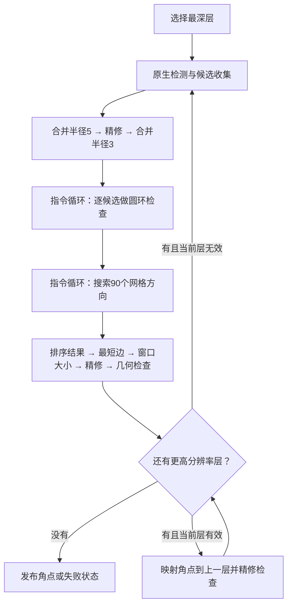

# 检测统一指令控制

当前板级检测使用**一个任务级指令核心**管理各阶段：决定调用哪个服务、循环多少次、失败后走哪条路径。计算服务内部仍保留必要的局部状态机，没有把每个像素都改成软件处理。

## 阅读入口

1. [detect_ctrl.sv](../rtl/image/features/detect_ctrl.sv) 的 `g_program_flow.control`：板级入口。`SHARE_BACKEND=1` 时实例化指令控制，不再实例化旧的顶层自动调度状态机。
2. [detection_flow_control.v](../rtl/control/detection/detection_flow_control.v)：连接核心与金字塔层、角点输出等接口。`dl` 是当前层，`stage` 是数据通路所有权，不是程序 PC。
3. [detection_program.v](../rtl/control/detection/detection_program.v)：保存 PC、取指、执行循环和等待服务。
4. [build_detection_program.py](../scripts/image/build_detection_program.py)：唯一维护的任务程序源；[flow.lst](../data/programs/detection/flow.lst) 是生成的可读清单。

外层仍通过原来的 `start/busy/done/status` 启动检测，DDR、角点输出和摄像头接口不变。`done` 保持到下一次启动；一次启动处理一张图的全部金字塔层。

## 程序控制什么



候选不足/超限、网格失败等由程序分支处理；候选为空时跳过逐点循环。层间映射、阈值和数值精度保持原有行为，没有新增算法重试。

| 服务适配器 | 保留职责 | 核心接管的控制 |
|---|---|---|
| `candidate_filter_ctrl` | 候选 DDR 工作区、合并/精修数据搬运、单个候选的圆环服务 | 合并5/精修/合并3的顺序、候选遍历、结束发布 |
| `grid_order_ctrl` | 一个方向内的投影、索引排序、窗口评分、网格检查和最佳结果更新 | 90 个方向的循环、开始排序/结束发布 |
| `grid_refine_ctrl` | 最短边、窗口计算、精修/检查调用及结果搬运 | 各步骤的顺序与启动 |

适配器在板级设置 `EXTERNAL_SEQ=1`，原自动推进阶段的分支由综合常量裁剪。`EXTERNAL_SEQ=0` 保留已有独立模块接口/回归兼容，不会在板上同时实例化第二套自动调度电路。

**尚未展开成标量指令的部分：** 单方向内部的投影/排序/评分循环、单点圆环内部控制、合并距离扫描、网格几何公式以及像素流水。它们是命令调用的计算服务，不能将本次称为“全部检测数值步骤都已指令化”。原 `feature_program` 继续执行精修求解和坐标更新微程序，公共 FP64 后端继续与标定共享。

## 一条命令如何运行

执行器有 `IDLE → FETCH → EXEC → WAIT_SERVICE` 四类状态。ROM 同步读取，当前命令完成后才取下一条，不预取或抢占任务。

- `service_valid`：当前命令有效，`service_id/arg` 保持到完成。
- `service_enter`：命令的第一个**使能时钟**。适配器仅在这一拍启动或切换阶段。
- `service_done`：服务完成。核心不会在 entry 拍接收完成，防止误收上次保持的 done。
- `service_result`：状态和计数，锁存后供分支/循环指令使用。
- `ce=0`：冻结核心、适配器、检测本地运算服务并关闭命令握手。全局复位取消任务；层切换清理局部服务，不复位核心。

例如 `CALL MERGE3` 返回剩余点数，`LOOP result.count` 装载次数；随后 `CALL RING_POINT,index` 检查一个候选，`NEXT ring` 推进索引。遍历计数和跳转已离开候选适配器。

排序执行 `LOOP 90`，每次 `CALL ANGLE,index` 只算一个方向，服务不自行推进下一方向；循环完再发 `ORDER_FINISH`，输出结果。

## 指令格式与维护方式

有效程序 **41×32 位**，ROM 深度 256。核心有一个循环上下文；候选循环与方向循环不嵌套，没有通用数值寄存器堆。

| opcode[31:28] | 指令 | 有效字段 |
|---|---|---|
| 0 | CALL | bit24：arg 用循环索引；service[23:16]；立即数[15:0] |
| 1 | BR | bit27：无条件；bit26：期望值；结果位号[20:16]；目标 PC[7:0] |
| 2 | LOOP | bit24：次数取上次结果[31:16]；否则取立即数[15:0]；清零索引 |
| 3 | NEXT | 索引加一，未到次数则跳到目标 PC[7:0] |
| 15 | END | 状态[1:0]：1成功、2无角点、3配置/程序错误 |

本指令编码不同于标定、数学和精修微程序。修改任务流程后，在仓库根目录运行：

```powershell
python scripts/image/build_detection_program.py
```

生成 `rtl/include/detection_program_init.vh`、`detection_services.vh` 和可读清单。生成物随代码交付，clone 后无需运行 Python 即可综合；不要手改十六进制 ROM 字。

## 实际合并的硬件

[fp32_pair_add_pool.v](../rtl/compute/service/fp32_pair_add_pool.v) 把 **8 条 FP32 加减通路合成 1 条**：候选合并的 X/Y 差值和累加四条、排序加减两条、网格精修 X/Y 差值两条。

四个客户端分别为合并差值、合并累加、排序、网格精修。成对运算先算 X 再算 Y，同时发布结果，保留原两轴同步返回的接口和逐次舍入顺序。

每个客户端有独立请求/响应槽。即使差值结果被距离服务反压，加法器仍能处理累加请求；否则“累加未完成不能消费距离、距离未消费又占着加法器”会死锁。这里保留了必要缓存，没有把需要重叠的计算直接无仲裁串接。

排序的原点镜像快照改为同步 RAM，最终输出直接读取已有 best RAM，移除了额外宽数组和组合读选择。同步读的等待拍显式处理，输出在背压时保持，完成后不会在取下一条指令时重复发布最后一点。

## 验证入口

当前数值和协议回归覆盖：

- 控制程序：16 个情形、1,604 次命令核对，覆盖循环、分支、CE、延迟和复位取消。
- 三层流程：4 个任务，覆盖原生回退、映射后精修失败、背压、响应图导出和连续任务。
- 共享加法器：512 个四客户端作业，覆盖单值/成对加减、CE、复位及一个响应阻塞时其它客户端继续完成。
- 收集：0、39、40、256、300 个点，覆盖不足、正常、溢出后排空和连续启动。
- 三张 160×120 图的真实检测：120 个角点、0 协议错误，最大偏差 **0.000038147 像素**，**29,731,619 周期**，40 MHz 约 **0.743 秒**。较上一轮 29,539,347 周期增加约 **0.65%**，不代表 720p 耗时。

资源实测及报告位置见 [标定与共享计算设计](CALIBRATION_ENGINE_ARCHITECTURE.md)。分块收益不能证明整板装入或布局布线收敛。

配置 `MODELSIM_BIN` 或 PATH 后，可在根目录复现：

```powershell
python scripts/image/check_detection_program.py
python scripts/compute/check_pair_add_pool.py
powershell -NoProfile -ExecutionPolicy Bypass -File scripts/system/run_checks.ps1 -OnlyTest tb_detection_capture
powershell -NoProfile -ExecutionPolicy Bypass -File scripts/system/run_checks.ps1 -OnlyTest tb_detection_fixed
```

