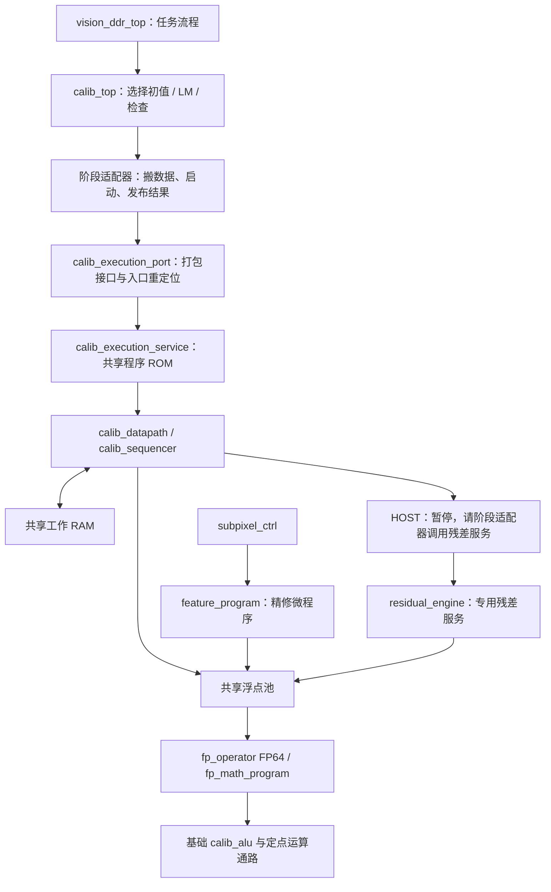

# 现在的指令控制怎么运行

本文是当前代码的阅读指南。先读入口和执行流程，再按需查看编码。整体数据流见[系统架构](SYSTEM_ARCHITECTURE.md)，标定阶段分工见[标定设计](CALIBRATION_ENGINE_ARCHITECTURE.md)。路径均相对仓库根目录。

## 1. 先区分各层执行器

现在没有一个从摄像头一直执行到 HDMI 的“大程序”。外层流程仍由 RTL 状态机启动各模块；计算较复杂、允许多拍完成的部分由微程序执行。

| 执行器         | 负责什么                     | 从哪里启动                              | 程序入口                | 数值存储                                                |
| -------------- | ---------------------------- | --------------------------------------- | ----------------------- | ------------------------------------------------------- |
| 检测任务执行器 | 金字塔层、候选/方向循环、精修调度 | `detect_ctrl` 的 start | PC=0 | 服务结果、循环索引与次数 |
| 标定执行器     | 初值、LM、结果检查的算法步骤 | 阶段适配器的`start_valid/start_ready` | 阶段入口 PC             | 8 个 A32 地址/整数寄存器、8 个 F64 寄存器，共享工作 RAM |
| 数学执行器     | EXP、LOG、三角函数等内部计算 | 浮点请求`req_valid/req_ready`         | 根据`req_op` 自动选择 | 256×144 RAM，保存 Q128 定点中间值、常量及浮点位模式    |
| 检测精修执行器 | 张量求解、坐标更新、收敛量   | `subpixel_ctrl` 的 `ts_start_p`     | 固定 PC=0               | 32×64 RAM                                             |

检测任务核心的入口为 `detect_ctrl.g_program_flow.control`，统一管理金字塔层、候选遍历、方向搜索和精修检查的调度，详见 [检测统一指令控制](DETECTION_ENGINE.md)。下面主要展开标定核心与数值后端。几何投影还使用 `geometry_engine` 的固定运算序列，它属于专用服务内部控制。

各层指令都是 **32 位，但编码不同，程序不能互换**。32 位是控制字宽度，不是计算精度；FP64 数据依然是 64 位。数学执行器内部还保留 Q128 精度。

它们不是完整通用 CPU：没有操作系统、软件中断或缓存，也不从 DDR 加载可执行程序。ROM 在综合/配置时初始化，板上按固定程序运行。Python 只在开发时生成 ROM，不参与板上计算。

## 2. 建议按这个顺序读源码

| 顺序 | 文件                                                                         | 重点看什么                                                       |
| ---- | ---------------------------------------------------------------------------- | ---------------------------------------------------------------- |
| 1    | [vision_ddr_top.v](../rtl/top/vision_ddr_top.v)                               | `cal_cmd_valid` 到 `calib_top.cmd_valid`；检测到浮点池的连接 |
| 2    | [calib_top.v](../rtl/control/calibration/calib_top.v)                         | `INIT_CMD/LM_CMD/CHECK_CMD`；`execution` 实例；当前阶段选择  |
| 3    | [init_controller.v](../rtl/control/calibration/init/init_controller.v)        | 最简单的“写入数据→启动→等待→读回结果”适配器                 |
| 4    | [calib_execution_port.v](../rtl/compute/service/calib_execution_port.v)       | 阶段局部 PC 如何加基地址；接口如何打包                           |
| 5    | [calib_execution_service.v](../rtl/compute/service/calib_execution_service.v) | 真正共享的程序 ROM 和`engine` 实例                             |
| 6    | [calib_datapath.v](../rtl/compute/service/calib_datapath.v)                   | 执行器、工作 RAM、浮点请求如何连接                               |
| 7    | [calib_sequencer.v](../rtl/control/calibration/engine/calib_sequencer.v)      | `FETCH/EXEC` 及访存、运算、HOST 等待状态                       |

注意：`calib_top` 中变量 `pc` 是**阶段状态机状态**；`calib_sequencer` 中的 `pc` 才是**指令地址**。同名并不意味着它们是同一个计数器。



## 3. 一次初值计算怎么启动、怎么结束

1. 任务流程通过 `calib_top.cmd_valid && cmd_ready` 提交标定任务。角点由既有收集接口写入并按任务流程提交；这一步不是向执行器逐条发送指令。
2. `calib_top` 进入 `INIT_CMD`，向 `init_controller` 发送阶段命令，随后在 `INIT_WAIT` 等待。整个阶段拥有共享执行器。
3. `init_controller` 先经 `host_*` 口写常量、配置、棋盘坐标和已检测角点，状态依次经过 `INITIALIZE`、`GRID_X/GRID_Y`、`READ_REQ/READ_WAIT`。
4. 到 `START` 时，适配器送出 `start_valid=1`、局部 `start_pc=0`。`calib_execution_port` 加上 `INIT_ENGINE_PC`，得到共享 ROM 中的绝对入口。
5. `start_valid && start_ready` 后，执行器自己取指执行；适配器留在 `RUN` 等待。DLT、Jacobi、位姿初值等步骤在程序里，不由适配器逐步控制。
6. 程序执行 `END`，执行器拉高 `rsp_valid` 并保持状态码，等待接收。适配器随后读工作 RAM 中的算法状态和 seed，经过 `SEED/RESPONSE` 发布数据与阶段响应。
7. `calib_top` 消费初值，进入 LM，之后再启动结果检查。阶段切换复用同一套执行器与工作 RAM。

当前共享 ROM 有效长度为 **3704 条**，物理深度 4096。入口由 [calibration_program_defs.vh](../rtl/include/calibration_program_defs.vh) 自动生成：

| 程序     | 当前基地址 | 有效指令数 |
| -------- | ---------: | ---------: |
| LM       |          0 |        713 |
| 结果检查 |        713 |       1343 |
| 初值     |       2056 |       1648 |

**ROM 排列顺序不等于运行顺序。** 初值先运行，却位于 ROM 后部。启动时载入指定 PC，所以无需先执行前面的 LM。添加指令后基地址可能变化，应使用宏，不能把这些数字抄进 RTL。

## 4. 一条标定指令如何执行

主执行器是阻塞、多周期执行器：当前指令完成后才取下一条，不做指令预取或多条指令并发。运算器内部可以多拍实现，但这不等于主执行器具有指令流水线。

| 状态              | 动作                                               | 何时离开                         |
| ----------------- | -------------------------------------------------- | -------------------------------- |
| `IDLE`          | 等阶段启动，接收入口 PC 和有效程序长度             | 启动握手                         |
| `FETCH`         | `imem_en=1`、`imem_addr=pc`，同步 ROM 读出指令 | 下一拍进入`EXEC`               |
| `EXEC`          | 译码，执行简单操作或发起后续状态                   | 由 opcode 决定                   |
| `MREQ → MWAIT` | 请求读写工作 RAM，等待返回或写确认                 | 成功则更新寄存器/PC，错误则退出  |
| `FREQ → FWAIT` | 请求共享浮点运算，等待返回                         | 写回 F 寄存器或比较标志后更新 PC |
| `HWAIT`         | HOST 服务暂停，保持 PC 和寄存器                    | `svc_ready` 后继续下一条       |
| `DONE`          | 保持执行完成响应                                   | `rsp_ready` 后回 `IDLE`      |

正常顺序执行令 `pc=pc+1`；分支、调用和返回改变 PC。相对跳转以“当前 PC+1”为基准。访问工作 RAM 的地址是 **64 位字索引，不是 DDR 字节地址**。

例如以下是真实 [pose.asm](../data/programs/calibration/pose.asm) 中的一小段：

```text
MOVI A0,0        # A0 保存工作区字地址 0
LD   F0,A0,0     # 从工作区读取一个 FP64 值
FLOG F2,F0       # 请求 log，执行器在 FWAIT 等待
ST   F2,A0,40    # 把结果写入工作区第 40 个 64 位字
```

`FLOG` 不会在一个时钟周期算完。它经过浮点池进入数学执行器，数学执行器运行自己的微程序；直到结果返回，外层标定程序才执行 `ST`。这就是两层指令控制之间的关系，外层无需知道内部循环多少次。

## 5. HOST 是什么，为什么还有状态机

这里的 **host 指阶段适配器 RTL，不是电脑，也不是另一个 CPU**。

算法程序擅长做数值步骤，角点接口和残差数据流仍由专用模块处理。LM 程序需要一轮残差时执行 `HOST 0`：

1. 执行器进入 `HWAIT`，拉高 `svc_valid` 和服务编号，暂停取指。
2. `lm_controller` 识别编号 0，从工作 RAM 读取本轮参数和目标缓冲区信息。
3. 适配器启动共享 `residual_engine`，将返回的残差流写回工作 RAM，并记录代价及状态。
4. 适配器进入 `RESUME`，通过 `svc_ready` 通知执行器继续。

HOST 暂停期间，执行器不争用 RAM，适配器可通过 `host_*` 访问；阶段所有权仍属于 LM，**不能趁此切换到初值或检查程序**。`host_ready` 只在任务间空闲或 HOST 暂停时开放。

因此保留的状态机主要负责协议、搬运、异常处理、阶段调度；矩阵与迭代步骤由程序负责。`KEXEC` 及可选硬件内核接口仍存在于通用执行器代码中，但板级服务设置 `ENABLE_KERNELS=0`，当前不能把它当成板上矩阵加速器入口。

## 6. 检测精修和数学程序的入口

**检测：** 看 [subpixel_ctrl.sv](../rtl/image/features/subpixel_ctrl.sv) 的 `feature_program` 实例与 `ts_start_p`。像素窗口、梯度和累加完成后，传入张量系数、右端向量及当前坐标；精修器锁存输入，从 PC=0 开始，经历 `LOAD → FETCH → READ → EXEC`，遇到算术指令进入 `ISSUE → WAIT_RESULT`。结束产生 `done/out_ok`，输出位移、更新坐标和收敛量，外层决定是否进行下一轮精修。

`refine=1` 包含坐标更新和收敛量；`tensor_solve` 包装器使用 `refine=0`，只取求解结果。`done` 保持到下一次接受启动，不是单拍脉冲。外层必须先看到本次启动被接受、旧 done 清除，再等待新的 done。

板级 `FP_SHARED=1` 时，精修器不带私有 ALU，而是浮点池第 5 号客户端。六个客户端为残差四路、标定执行器一路、精修一路；不是六个浮点核。CE 暂停精修器时仅阻止该客户端推进和握手，不停止外部公共运算器。

**数学：** 看 [fp_math_program.v](../rtl/compute/float/fp_math_program.v) 的 `DECODE`。外部只发 `req_op/req_a/req_b`，不传程序地址。基础操作转到 `BASIC_REQ/BASIC_WAIT` 调用 `calib_alu`；复杂函数选择生成的 `MP_EXP/MP_LOG/MP_TRIG/MP_ATAN/MP_ACOS` 等入口，并通过定点微指令运行级数或 CORDIC。特殊值也在该后端处理。

数学后端每次接收一笔运算，完成后保持 `rsp_valid/result/flags`，直到 `rsp_ready`。复位取消在途操作。检测精修和标定共享此后端，由池仲裁，不会同时占用它执行两笔操作。

## 7. 指令与程序到底应该改哪个文件

| 想改什么               | 维护源                                                                                                   | 生成物/执行位置                                                             |
| ---------------------- | -------------------------------------------------------------------------------------------------------- | --------------------------------------------------------------------------- |
| 标定指令编码、合法操作 | [isa.json](../data/programs/calibration/isa.json)、`assemble.py`，并同步 RTL 译码/执行语义              | `calib_engine_defs.vh`、`calib_engine_decode.vh`、`calib_sequencer.v` |
| 初值步骤               | [build_init.py](../scripts/calibration/engine/build_init.py)，引用 `pose.asm`、`rotation_inverse.asm` | `init_program_*.vh`                                                       |
| LM 步骤                | [build_lm.py](../scripts/calibration/engine/build_lm.py)，引用 `solve.asm`                              | `lm_program_*.vh`、`lm_constants.vh`                                    |
| 检查步骤               | [build_validate.py](../scripts/calibration/engine/build_validate.py)                                      | `validate_program_*.vh`                                                   |
| 三个阶段合成一份 ROM   | [build_rom.py](../scripts/calibration/engine/build_rom.py)                                                | `calibration_program_init.vh`、`calibration_program_defs.vh`            |
| 数学函数内部步骤       | [build_math.py](../scripts/compute/microcode/build_math.py)                                               | `math_program_*.vh`、`data/programs/math/program.lst`                   |
| 精修步骤               | [build_feature.py](../scripts/compute/microcode/build_feature.py)                                         | `feature_program_init.vh`、`data/programs/features/refine.lst`          |

初值、LM、检查生成的可读汇编在 `build/calibration_engine/` 下的 `init.asm/lm.asm/validate.asm`，用于查看和调试，**不是维护源**。`data/programs/calibration/pose.asm` 等输入汇编则是维护源。不要把生成结果和源混为一谈，也不要直接修改初始化头文件中的十六进制指令。

标定主指令字段为：

```text
31       26 25    23 22    20 19    17 16    14 13                 0
  opcode     mode      rd       ra       rb       immediate
   6 位      3 位      3 位     3 位     3 位        14 位
```

常用组包括整数地址计算、LD/ST、浮点运算、比较与分支、CALL/RET、HOST、END。完整合法形式以 `isa.json` 为准。数学及精修指令采用各自紧凑字段，具体在生成器及 RTL 文件头说明；新增算法步骤通常只需修改程序，不需增加 opcode。

在仓库根目录生成程序：

```powershell
python scripts/image/build_detection_program.py
python scripts/calibration/engine/build_rom.py
python scripts/compute/microcode/build_math.py
python scripts/compute/microcode/build_feature.py
```

生成的 `.vh` 随源码交付，因此 clone 后正常综合不必先装 Python，也不需要运行时加载程序文件。修改生成器/输入汇编后则必须重新生成并一起提交；ROM 初始化会进入 FPGA 配置数据。

## 8. 调试时看哪些信号

| 现象                 | 先看哪里                                                                                |
| -------------------- | --------------------------------------------------------------------------------------- |
| 算法未开始           | `calib_top` 阶段、适配器 `state`、`start_valid/start_ready`                       |
| 卡在某条指令         | `calib_sequencer.pc/state`、ROM 输出 `imem_data`，对照生成汇编                      |
| 卡在浮点等待         | `shared_req_valid/ready`、`shared_rsp_valid/ready`、池所有者、数学后端 `state/pc` |
| 卡在 HOST            | `svc_valid/svc_id`、适配器残差状态及 `svc_ready`                                    |
| 程序结束但外层没响应 | 执行器`rsp_status`、算法 RAM 状态、适配器读回与输出背压                               |
| 精修似乎直接完成     | `ts_start_p`、`busy/done`，是否误把上次保留的 done 当成本次结果                     |

执行器状态码和算法状态是两层：执行器正常结束不自动证明标定有效，适配器还需读取算法结果。板级目前没有将 PC/指令计数引出到外部引脚；共享模式 `calib_execution_port` 的调试输出接零，仿真调试要进入真实共享执行器层次观察，不能盯着适配器的零输出。

按修改范围运行对应检查，不必每次跑整板：标定程序用 `scripts/calibration/engine/check_init.py`、`check_lm.py`、`check_validate.py`；数学后端用 `scripts/compute/run_fp_operator.ps1`；精修用 `scripts/compute/check_feature_program.py`。只改本文或入口注释，不需要重新跑数值综合。
