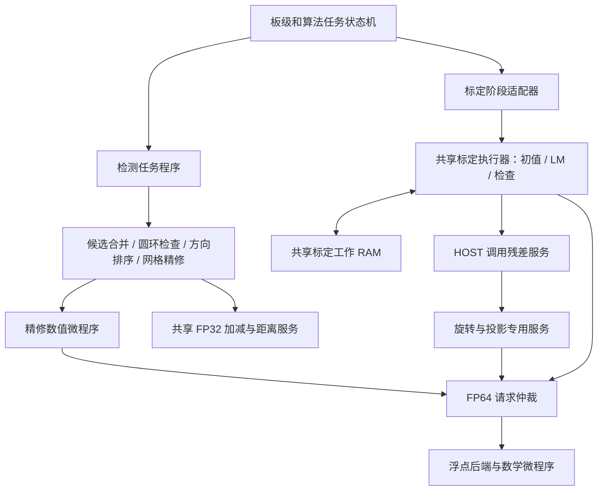

# 整体处理流程与设计架构

## 1. 两个入口

[calibrated_view_top](../rtl/top/calibrated_view_top.v) 连接摄像头、DDR IP、算法时钟、任务控制和 HDMI。[vision_ddr_top](../rtl/top/vision_ddr_top.v) 连接灰度 DMA、角点检测、标定、建表和去畸变，是算法的 DDR 到 DDR 边界。

板级负责获得一张稳定的图像并交出地址；算法负责返回校正图地址及状态。采集、显示与算法各自具有时钟和流量控制，互相通过 FIFO、跨域命令/响应与访存仲裁交接。

## 2. 一次任务如何运行

| 阶段 | 输入 → 输出 | 控制与计算 | 数据保存位置 |
|---|---|---|---|
| 采集 | 摄像头像素 → 完整 RGB565 帧 | `video` 的采集通路与 `control/system` 任务调度 | DDR 原图区 |
| 灰度 | RGB565 → Gray8 | 灰度 DMA、DDR 服务 | DDR 灰度区 |
| 检测 | 灰度图 → 排好序的角点 | 检测任务程序调用候选、排序、精修服务 | 灰度/候选在 DDR，局部窗口和结果在片上 |
| 收集 | 每图角点和检测状态 → 完整标定输入 | `corner_store` 按 view 和点号记录 | 片上角点 RAM |
| 初值 | 角点 → 内参、畸变、各图姿态的初始状态 | 初值适配器启动共享标定程序 | 标定工作 RAM |
| LM | 初始状态 → 优化状态 | 标定程序调度差分、方程和阻尼更新；调用残差服务 | 工作 RAM 与阶段状态缓存 |
| 检查 | 优化状态 → 相机参数及诊断 | 检查程序计算残差统计、姿态和映射有效性 | 参数寄存器/发布接口 |
| 建表 | 相机参数 → 每个输出像素的源坐标 | 映射坐标专用数据通路 | DDR X/Y 表 |
| 校正 | 原图和映射表 → RGB565 校正图 | 地址生成、邻域读取、双线性插值和写回 | DDR 结果区 |
| 显示 | 原图/结果区 → HDMI | 显示 DMA、跨域 FIFO、显示时序 | FIFO 加 DDR |

检测与标定之间只传角点和状态，标定不再读取原图。每张标定图检测结束后保存角点，可以复用原图区；最后一张原图留给去畸变。失败由任务响应返回，成功参数发布后才进入建表和校正。

## 3. 指令控制器放在哪里

检测程序决定“哪个候选、哪个方向、下一层还是结束”；数值服务负责“一次具体计算怎样完成”。标定执行器更细，直接执行工作 RAM 读写、浮点运算、循环和分支。数学微程序则实现一次复杂数学运算内部的步骤。

此外 `geometry_engine` 使用固定运算序列完成投影，是残差服务内部的数据通路控制。这里不是一个大 CPU 管所有像素，也不能按指令控制器的数量推断浮点核数量。

## 4. 为什么能够节省硬件

初值、LM、检查按阶段执行，共用一个标定取指核心和一份工作 RAM；检测精修与标定的 FP64 请求汇入同一物理后端。检测中候选差值、累加、排序、网格精修的加减请求进入带独立响应槽的 FP32 池。

中间数据写 RAM，后续指令再读出，减少宽寄存器阵列和多路组合选择。共享增加等待周期，像素窗口、采集显示、DDR 接收等持续吞吐通路因此仍保留独立电路。

## 5. 时钟和存储边界

算法时钟由 `rtl/clock/algorithm_clock.v` 提供，目标 40 MHz。板级顶层负责连接算法域与 DDR/视频域；跨域接口保留完整的命令、载荷及响应归属。像素流水通过专用 FIFO 保持顺序。

DDR 地址表见[根 README](../README.md#当前-ddr-分区)。片上 RAM 主要分为行窗口/邻域缓存、请求响应 FIFO、角点缓存、排序工作区、标定工作区、程序 ROM。程序 ROM 存的是操作顺序，工作 RAM 存的是本次计算的数据，两者职责不同。

标定工作 RAM 按 64 位字寻址，算法 DDR 接口按字节寻址。程序由 Python 生成到 RTL 初始化头文件，配置 FPGA 时一起装入，运行中不依赖 PC 或 Python。

## 6. 修改代码从哪里开始

| 修改内容 | 维护位置 |
|---|---|
| 整次采集、标定和显示顺序 | `rtl/control/system`、`rtl/top` |
| 检测阶段顺序、候选/方向循环 | `scripts/image/build_detection_program.py` |
| 一个候选、一个方向内的算法 | `rtl/image/features` |
| 初值、LM、检查的计算步骤 | `scripts/calibration/engine/build_*.py`、`data/programs/calibration` |
| 指令执行、共享运算和数值精度 | `rtl/control/calibration/engine`、`rtl/compute` |
| DDR、缓存和带宽 | `rtl/memory` |
| 校正吞吐和采样 | `rtl/image/remap` |
| 摄像头和 HDMI | `rtl/video`、板级顶层和 FDC |

完整程序接口见[指令控制指南](INSTRUCTION_CONTROL_GUIDE.md)，检测流程见[检测设计](DETECTION_ENGINE.md)，标定程序分工见[标定设计](CALIBRATION_ENGINE_ARCHITECTURE.md)。
