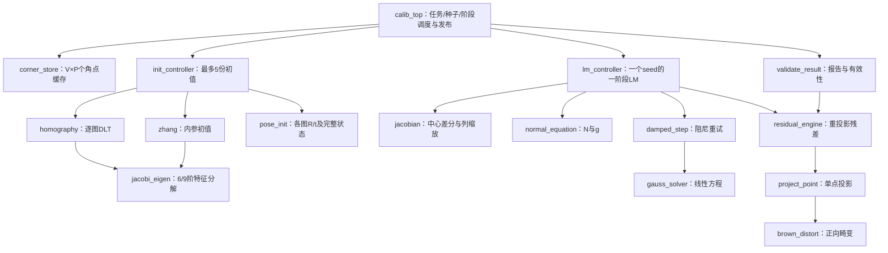

# 标定参数模块

本目录属于 **刘承昊负责的第二部分**：接收多张图的有序角点，计算内参、畸变系数和诊断结果。默认 **3 视图、每视图 5×8 个内角点、k3=0**；视图数、棋盘行列数和迭代上限统一在 [calib_config.vh](rtl/common/calib_config.vh) 配置。范围、接口位宽和仿真方法见 [CONFIGURATION.md](CONFIGURATION.md)。输入不包含图像，模块不访问 DDR。

**19个模块均已实现，包括calib_top的任务收集、五候选三阶段优化、最优结果选择、校验和发布。** 顶层已通过45组控制场景和2组真实RTL集成场景，0错误；完整链路运行全部五个初值，与原C++参数和诊断结果对比通过。对接、测试方法和实测周期见 [CALIB_TOP.md](sim/CALIB_TOP.md)。角点缓存见[仿真说明](sim/README.md)，投影模型层见 [MODEL.md](sim/MODEL.md)，初始化层见 [INIT.md](sim/INIT.md)，LM层见 [LM.md](sim/LM.md)，最终结果检查见 [VALIDATE_RESULT.md](sim/VALIDATE_RESULT.md)。尚未进行综合、时序或上板验证。

## 1. 从哪里看起

真实图片导出的120个角点已完成端到端对比：五个候选、十五次LM调用和全部50项数值检查通过；9个FP32相机参数中8个逐位相同，k2相差1 ULP。详细数据和复现命令见 [实拍角点对比](sim/REAL_CALIBRATION.md)。

先看 [calib_top.v](rtl/control/calib_top.v) 的对外接口，再按下图阅读。状态和数据打包规则集中在 [calib_defs.vh](rtl/common/calib_defs.vh)。



图中同名算术/残差核可以有多个实例。rotation 和 fp_operator 是下层工具核，具体调用方见各文件注释；目前没有强制设计全局浮点仲裁器。

## 2. 文件分工与实现边界

目录分为控制层、标定算法层、投影模型层、基础数学层和公共定义层。标定算法层再按初值、迭代、结果检查拆成三个子目录：

```text
parameter/                         原有项目目录
├── README.md                      规划与接口说明
├── CONFIGURATION.md               配置范围、派生尺寸、对接与多配置测试
├── files.f                        编译清单（含头文件搜索路径）
├── sim/                           corner_store测试平台、运行脚本和仿真说明
└── rtl/
    ├── control/                   任务调度与输入缓存
    │   ├── calib_top.v
    │   └── corner_store.v
    ├── calibration/               标定算法
    │   ├── init/                  初值计算
    │   │   ├── init_controller.v
    │   │   ├── homography.v
    │   │   ├── zhang.v
    │   │   └── pose_init.v
    │   ├── lm/                    LM迭代
    │   │   ├── lm_controller.v
    │   │   ├── jacobian.v
    │   │   ├── normal_equation.v
    │   │   └── damped_step.v
    │   └── check/                 结果检查与报告
    │       └── validate_result.v
    ├── model/                     相机投影与旋转模型
    │   ├── residual_engine.v
    │   ├── project_point.v
    │   ├── rotation.v
    │   └── brown_distort.v
    ├── math/                      通用数学运算
    │   ├── gauss_solver.v
    │   ├── jacobi_eigen.v
    │   ├── fp_operator.v
    │   ├── fp_divsqrt.v            浮点除法/平方根逐拍迭代核心
    │   ├── fp_bits.vh              基础浮点位运算与舍入
    │   └── fp_constants.vh         高精度范围缩减和CORDIC常量
    └── common/                    公共接口定义
        ├── calib_config.vh        视图数、棋盘规格、迭代上限
        ├── calib_defs.vh          自动派生位宽/容量和状态码
        ├── calib_geometry.vh      棋盘中心化坐标
        └── calib_lm_layout.vh     三阶段活动参数顺序
```

control负责调用calibration中的阶段模块；calibration按需要调用model和math；model中的投影与旋转也使用math；各层都读取common定义。目录不代表每层只允许调用紧邻下一层，例如DLT直接调用math中的特征分解器。

文件和模块按功能命名，不再使用统一前缀；顶层命名为 calib_top。目录表示职责分层，实际调用关系见上图；Verilog 模块名在工程内仍需保持唯一。

| 文件（rtl/下） | 宏观职责与内部数据 | 谁调用 |
| --- | --- | --- |
| control/calib_top.v | 缓存最多5份seed，维护best，调度三阶段，输出参数/诊断/完成 | 外部系统顶层 |
| control/corner_store.v | PAR_TOTAL_POINTS×2个FP32角点和视图提交状态；只读服务 | 本子系统顶层 |
| calibration/init/init_controller.v | 各视图H、候选内参、seed枚举；不运行LM | top |
| calibration/init/homography.v | PAR_POINTS点归一化DLT，9×9矩阵构造和反归一化 | init_controller |
| calibration/init/zhang.v | 各视图H形成6×6约束，恢复内参seed | init_controller |
| calibration/init/pose_init.v | 给定K/H恢复各图R/t，生成PAR_STATE_N项状态 | init_controller |
| calibration/lm/lm_controller.v | current/trial、当前残差、lambda、阶段内迭代与重试 | top |
| calibration/lm/jacobian.v | 正负扰动、单列缓存、列范数、缩放J输出 | lm_controller |
| calibration/lm/normal_equation.v | 完整J和基准r缓存，计算N/g | lm_controller |
| calibration/lm/damped_step.v | 不变N/g缓存、每次构建A/b、调用消元 | lm_controller |
| math/gauss_solver.v | 最大PAR_ACTIVE_N元增广矩阵，选主元、消元、回代 | damped_step |
| math/jacobi_eigen.v | 最大9阶A/V、旋转、特征值排序 | homography、zhang |
| model/residual_engine.v | 解码状态、遍历PAR_TOTAL_POINTS点、输出PAR_RESIDUALS项残差与cost | lm_controller、validate_result |
| model/project_point.v | 一点的R/t变换、透视除法、畸变、内参投影 | residual_engine |
| model/rotation.v | Rodrigues与稳定的矩阵转旋转向量 | pose_init、residual_engine、validate_result |
| model/brown_distort.v | FP32/FP64正向畸变公共核 | project_point；第三人可复用 |
| calibration/check/validate_result.v | 最佳状态转参数、RMS/姿态、几何及映射有效性 | top |
| math/fp_operator.v | 自主浮点算术、超越函数、比较和格式转换 | 各计算模块 |
| math/fp_divsqrt.v | FP32/FP64除法与平方根，每拍生成一位商或根 | fp_operator内部独占调用 |
| common/calib_defs.vh | 尺寸、状态布局、错误码、浮点操作码 | 全部文件 |

共 **18 个 Verilog 模块 + 1 个接口定义头文件 + 2 个算术实现头文件**。小型点积、叉积、矩阵构造循环留在使用它们的模块中；矩阵求解和重复调用的投影独立切分，避免大量只有一条算式的文件。

## 3. 与另外两人的连接

### 3.1 接收角点和启动

本稿补充了一个需要审核的握手：`collect_valid/collect_ready/collect_job_id`。它只表示“清空旧角点，准备收集这个任务”，不是标定启动。没有单独的收集命令，就必须依赖首点隐式清缓存，错误恢复和重复任务会不清楚。

1. 系统顶层发 collect，指定 job_id。calib_top管理任务号，并向corner_store发一拍clear；清空周期不接收角点/检测响应，从下一拍开始转发。
2. 苏晨的角点流按 view=0..PAR_VIEWS−1，每组 point_index=0..PAR_POINTS−1 发送；x/y为原图像素FP32，每图最后一点last=1。
3. 系统顶层转发每张图的检测完成响应 view_rsp。每视图的数据握手完成后才发成功响应；失败可在任意已接收点数时报告。
4. PAR_TOTAL_POINTS点完整且全部视图都成功后，calib_top 才使标定 cmd_ready 有效，接收 job_id、width、height、square_size。
5. 任一检测失败或流格式错误，禁止本任务标定，返回失败诊断和完成响应；不等待标定cmd，不补零。保留各图已收点数、检测状态及错误标记，不清掉其他图的调试状态。顶层停止转发并由系统停止/排空旧流，接收完成响应后再collect。
6. 参数计算期间锁定角点缓存，直至该任务最终rsp被接收；不接收另一任务。

这是根 README 原有“收齐并确认成功才启动”的具体实现提案。首版不支持视图交织、局部重传或多任务并发。错误job/非法尺寸等已接收命令应返回BAD_CONFIG，不能无声忽略；数值边界检查在初值阶段完成。

### 每张图的状态与内部缓存简化

corner_store不再保存job_id，也不再有collect和整次收集rsp握手；改用clear开始新任务。任务编号校验和整次完成响应都由calib_top负责。缓存仍保留带view_id/point_index的角点写入，以及每张图的view_rsp完成通知。

| 缓存输出 | 含义 | 顶层调试输出 |
| --- | --- | --- |
| view_done[PAR_VIEWS−1:0] | bit v：收到第v图检测结束通知，成功/失败都置位 | dbg_view_done |
| view_status[8×PAR_VIEWS−1:0] | 第v图占[8*v +: 8]，原始检测状态码；done=1才解释 | dbg_view_status |
| view_point_count[PAR_POINT_BITS×PAR_VIEWS−1:0] | 第v图占[PAR_POINT_BITS*v +: PAR_POINT_BITS]，通过格式检查并写入的点数0..PAR_POINTS | dbg_view_point_count |
| view_format_error[PAR_VIEWS−1:0] | 每图输入顺序/last/有限性等错误，或成功通知时点数不足 | dbg_view_format_error |
| view_usable[PAR_VIEWS−1:0] | 已结束、检测成功、完整PAR_POINTS点且无格式错误 | dbg_view_usable |

这些是持续可见的状态线，不额外握手。view_status=0但done=0表示尚未得到结果，不能当作成功。读取与任务结束不清除状态，下一次clear/复位才清除；整个任务失败时，即使某些图usable=1，顶层也不得启动标定。非法view_id/job由顶层在转发前检查，不能截断编号而污染有效图。全局错误仍通过diag/rsp报告。

### 3.2 输出给强文韬

- camera 为单拍流，携带 calib_id、width、height、camera_usable，以及9个FP32参数。低位起依次 **fx,fy,cx,cy,k1,k2,k3,p1,p2**。
- `camera_valid` 是流握手信号；`camera_usable` 对应根README参数包里的有效性字段，两者不能混淆。
- 成功输出一笔camera和一笔diag，失败只输出diag；两路可分别背压。最终rsp在应发的两路数据均被接收后输出。
- 下游只有收到可用参数包和成功rsp后才更新校正参数。诊断的R/t无需交给图像校正。
- diag包含任务号、失败阶段、最佳seed、接受步数、收敛、弱几何、总/分视图RMS、最大误差、姿态。未得到有效best时metrics_valid=0，数值字段不解释。
- 不使用诊断的接收端也必须接收diag（可令diag_ready=1），否则完成响应会等待。

## 4. 内部接口与数据归属

**统一时序：** 同一个core_clk，低有效rst_n同步释放；除下面明确约定的角点RAM读口、clear与持续状态线外，命令、数据流、响应使用valid/ready。生产端在背压时保持有效信号和载荷；一笔请求的响应被消费后才开始下一笔。运算核延迟可变，不能假定浮点运算一拍完成。复位取消整个子系统所有事务。

**宽向量只用于少量控制快照：** state为PAR_STATE_N×64位，H为9×64位，K为4×64位。命令握手锁存，元素0在最低位，不是逐项跨周期的隐式串行协议。这些宽端口是模块内部连线，不是FPGA引脚或DDR数据口。J、N/g、矩阵、残差使用逐元素流，禁止把大矩阵做成整块并行端口。若后续资源评估要求将state改为RAM访问，需要一起修改调用双方。

**角点读服务：** 缓存输入rd_en、rd_view_id[PAR_VIEW_BITS−1:0]、rd_point_index[PAR_POINT_BITS−1:0]，输出rd_valid及x/y FP32；调用方对应端口为point_rd_en、point_rd_view_id、point_rd_index、point_rd_valid、point_rd_x/y_fp32。按图号0..PAR_VIEWS−1和图内点号0..PAR_POINTS−1访问，缓存内部地址=view*PAR_POINTS+point。去掉请求ready、返回ready和逐次error。

固定同步读延迟为1拍：E_n上升沿采样rd_en/地址，坐标和rd_valid在该沿后有效，调用方在E_(n+1)采样。发起前须预留接收寄存器，无返回背压；首版最多一笔在途，收到返回后才能发下一笔。调用方只读已usable的图和合法索引，非法读属于设计错误，后续testbench用断言检查；不使用error响应作为正常控制流。clear/复位取消在途读。

top按初始化、LM、验证三个互斥阶段路由到corner_store；init内部再路由给homography。所有读路由首版使用组合连接，消费在途返回前不得切换所有者；后续若增加寄存器或更换RAM延迟，必须同步修改契约。FP32到FP64提升在计算端完成。

**残差服务：** LM拥有一个residual_engine，依次服务基准、jacobian正/负扰动和trial。jacobian的eval_*由LM转接residual_engine的cmd/data/rsp，width/height取当前LM任务。未收到rsp前不切换请求方。成功必须有PAR_RESIDUALS个残差；提前失败允许少于该数量，接收者以失败rsp终止并作废整次结果。

**矩阵加载：** normal_equation先接受cmd，再接收PAR_RESIDUALS个基准残差和PAR_RESIDUALS×n个缩放J；残差按索引递增，J按列外层、行内层。normal_equation全部收齐后计算，输出N下三角再输出g。damped_step须先接受load后才连接ng流，load_rsp成功后才可solve。LM须同时处理正常完成和早期失败，不能只等待last。

**取消不完整加载：** jacobian失败时，LM给normal_equation的abort，以及已开始load的damped_step的load_abort；停止对应输入流并接收各自失败响应后才进入下一阶段。取消与数据同周期时取消优先，接收端必须压低对应数据ready。不能仅在上层跳状态，留下子模块等待缺失数据。矩阵/残差的长度和last不匹配属于BAD_CONFIG。

**内存所有者：** corner_store持有观测；init持有H；top持有seed和best；LM持有current/trial及基准残差；jacobian持有正负扰动/单列；normal持有J；damped_step持有原始N/g；gauss持有可破坏A/b。外迭代可覆盖J/N，但阻尼重试不得修改缓存的N/g。

默认配置完整J需要240×26×8=49,920字节，通用公式为PAR_RESIDUALS×PAR_ACTIVE_N×8，角点约960字节；其他矩阵、残差和状态还需额外RAM。这是容量规划，不代表已确定FPGA资源能满足。底层RAM/FIFO使用团队公共封装，内部RAM端口不暴露为算法模块对外协议。

## 5. 迭代控制必须保持的算法含义

内部状态不是最终参数包。PAR_STATE_N项FP64包含内参、5槽畸变和各视图R/t；R以旋转向量表示，焦距和tz使用log。对象点用中心化单位格，square_size只用于最终平移报告。

| 阶段 | 活动参数顺序 | 数量 |
| --- | --- | --- |
| stage0 | 0,1,2,3,9..PAR_STATE_N−1 | 4+6×PAR_VIEWS |
| stage1 | stage0之后追加4（k1） | 5+6×PAR_VIEWS |
| stage2 | stage1之后追加5,6,7（k2,p1,p2） | 8+6×PAR_VIEWS |

因此R/t在三个阶段始终参与迭代；k3保留槽位但固定0。每seed最多3×PAR_LM_MAX_ITERS轮外迭代，每轮最多PAR_LM_MAX_TRIES次阻尼试探（默认150/16）。前两阶段不收敛仍把最后接受状态传入下一阶段；最终阶段converged作为该seed的收敛标记。非零硬件/协议错误终止任务，不能伪装成算法未收敛。

中心差分步长为1e-6*(1+abs(p))，按列归一化后构建N/g。lambda每阶段从1e-3开始；拒绝乘10，接受乘0.3且不低于1e-12。trial必须严格降低cost才提交。

阶段收敛条件沿用源码：

- 当前cost<1e-16，或max_abs(g)<1e-8*(1+sqrt(cost))。
- 接受后最大相对步长<1e-9，或代价下降量<1e-11*(1+新cost)。
- PAR_LM_MAX_TRIES次均未接受，仅在max_abs(g)<1e-5*(1+sqrt(cost))时认为收敛。
- 阶段迭代耗尽、初始/扰动残差无效返回未收敛；保留此前已接受状态。

top按最终cost严格最小选择best，再验证best.converged，不能先筛掉未收敛seed。最终验证的FP32量化位置、RMS分母PAR_TOTAL_POINTS、姿态坐标恢复、33×25映射采样均须与C++一致。weak_geometry在视图数<5或最大法向夹角<0.17时为1，仅作提示。

## 6. 集成与后续验证

三人对接时重点核对：collect后的一拍clear、每图最后一点和完成响应的先后、失败后旧数据流的停止，以及camera/diag/rsp的接收规则。详细行为见 [顶层说明](sim/CALIB_TOP.md)。

公共浮点/Brown封装暂放本目录；冻结后与另外两人协调迁入公共目录，避免复制维护。calib_defs.vh中的团队通用字段也要并入唯一vision_defs.vh；目前未创建或覆盖全局公共头文件。FP32/FP64算术及exp/log/trig现由本目录RTL实现；超越函数采用近似算法，资源和时序仍需综合评估，不能据此承诺板上性能。

各层实现已完成，后续使用真实角点检测结果扩充端到端测试，并在目标器件上进行综合、资源和时序评估。顶层测试不依赖硬件角点检测模块；输入可以直接替换成其输出的各组有序FP32坐标。

参考：[团队约定](../README.md)、[算法原理](../algorithom/closer2fpga/docs/ALGORITHM_OVERVIEW.md)、[C++标定入口](../algorithom/closer2fpga/closer2fpga/algo/calibrate.cpp)、[C++ LM](../algorithom/closer2fpga/closer2fpga/algo/calibration/lm.cpp)。

files.f 列出全部 Verilog 源文件及头文件搜索路径。corner_store 已通过 21 组场景、3240 次检查；fp_operator 通过 20249 组数值向量及握手/复位检查，见[算术仿真说明](sim/FP_OPERATOR.md)。gauss_solver 通过 45 组矩阵及 8 组接口/复位场景，见[高斯求解仿真说明](sim/GAUSS_SOLVER.md)。jacobi_eigen 通过 30 组矩阵、8 组接口/复位及 2 组搜索上限场景，见[特征分解仿真说明](sim/JACOBI_EIGEN.md)。model 四个模块通过 593 组数值/异常场景及 16 组额外复位恢复场景，见[模型层仿真说明](sim/MODEL.md)。init 四个模块通过 101 组场景及 14 组额外复位恢复场景，包含真实corner_store联调，并用原C++函数复核50组参考场景，见[初始化仿真说明](sim/INIT.md)。上述验证均为 0 错误。LM四个模块通过83组场景、0错误，包含三个真实迭代场景与原C++结果对比，见[LM仿真说明](sim/LM.md)。validate_result的实现与测试见[结果检查说明](sim/VALIDATE_RESULT.md)。calib_top已实现并通过45组控制场景，完整链路说明见[顶层仿真说明](sim/CALIB_TOP.md)。尚未进行目标器件综合、资源或时序验证。
