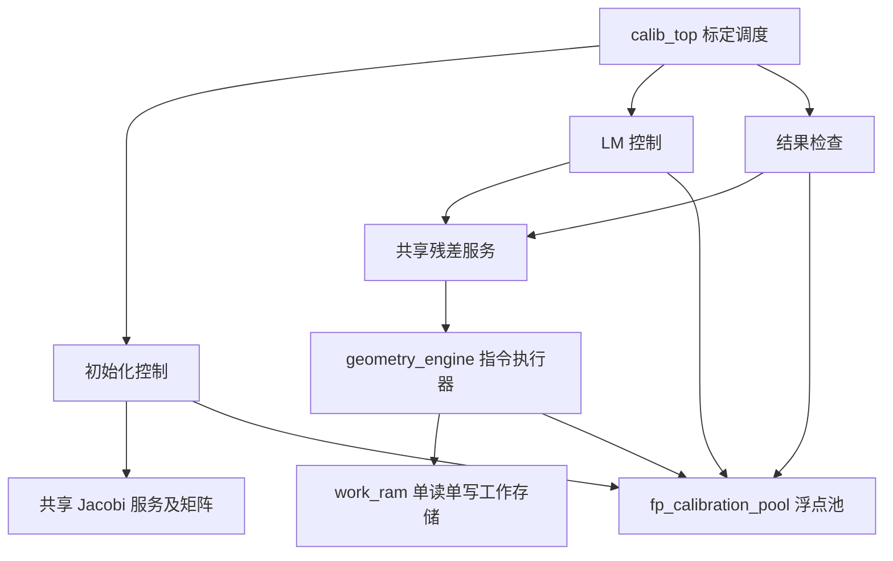

# RTL 阅读与开发指南

按硬件职责划分，不按原来的三人分工保存副本。厂商生成的 DDR/PLL 等 IP 保留在 `OV5640_DualView_100H/ipcore`，由 PDS 的 IDF 管理。

## 目录与阅读顺序

```text
rtl/
├─ top/                     集成连线：板级入口、DDR 算法入口、相机入口
├─ control/
│  ├─ system/               采集多张图、帧交接、启动/完成/失败调度
│  ├─ frame/                帧所有权、参数发布、校正任务调度
│  └─ calibration/          标定任务与种子调度
│     ├─ init/              DLT、Zhang、姿态初值的计算步骤
│     ├─ lm/                雅可比、正规方程、阻尼和收敛控制
│     └─ check/             重投影误差与参数有效性检查
├─ compute/
│  ├─ service/              浮点池仲裁、共享残差/特征分解接口
│  ├─ float/                请求/响应浮点核及校正运算服务
│  │  └─ stream/            检测使用的流式算术单元与格式转换
│  ├─ linalg/               高斯求解、Jacobi 特征分解
│  └─ geometry/             旋转、投影、畸变、重投影残差
├─ memory/
│  ├─ local/                单写单同步读工作 RAM
│  ├─ parameters/           角点和参数的持久缓存
│  ├─ ddr/                  DDR 仲裁服务、物理 HMIC 适配
│  └─ image/                灰度 DMA、像素读取、图像侧 DDR 端口
├─ image/
│  ├─ kernels/              窗口、梯度、张量、插值等局部像素运算
│  ├─ features/             候选点、筛选、排序、网格与亚像素定位
│  └─ remap/                校正坐标、映射表、邻域采样和输出
├─ video/
│  ├─ board/                摄像头/HDMI 配置、I²C、显示时序
│  ├─ dma/                  相机写入和显示读出
│  └─ stream/               像素格式、跨时钟显示接口
├─ common/                  同步 FIFO、异步 FIFO、复位同步等基础件
├─ include/                 尺寸/状态/数值定义、指令表、公共 package
└─ files.f                  仿真公共源码清单，路径相对仓库根目录
```

从 [calibrated_view_top.v](top/calibrated_view_top.v) 看实际板级连接，从 [vision_ddr_top.v](top/vision_ddr_top.v) 看 DDR 输入到 DDR 输出的算法边界。顶层负责连线和时钟域，任务控制器负责“什么时候做”，计算模块负责“怎样算”，存储模块负责“如何访问”。图像模块保留局部数据流控制，避免把相关像素运算和它的窗口状态强行拆散。

`control/calibration` 仍包含尚未改成指令程序的算法控制器。这次没有把整套初始化和 LM 全部改为一个处理器；后续可以继续迁移其工作寄存器，但必须用面积和周期测量决定是否保留。

## 实际共享的硬件



- [fp_calibration_pool.v](compute/service/fp_calibration_pool.v)：集中仲裁标定计算请求，记录响应归属；`shared_active` 撤销在途任务。请求者只在握手后获得服务，不依赖固定运算延迟。
- [geometry_engine.v](compute/geometry/geometry_engine.v)：一个指令控制器执行“外参变换→透视除法→Brown→内参投影”；中间值写回一份 RAM。`project_point` 与 `brown_distort` 只保留接口适配，不再各存一套算法实现。投影内部不再实例化独立 Brown 运算器。
- [work_ram.v](memory/local/work_ram.v)：一写口、一同步读口；两个操作数分拍读取，不用复制存储体换读端口。RAM 不复位，调用者必须保证先写后读。
- [damped_step.v](control/calibration/lm/damped_step.v)：N 的下三角和 g 共用一份重试缓存。地址 `0..PAR_TRIANGLE_SIZE-1` 存 N，随后存 g；不同 lambda 重试时只读原始数据，不破坏缓存。
- `init_controller` 在互斥阶段共用 Jacobi；`calib_top` 在 LM/检查阶段共用残差服务。完成或取消并处理旧响应后才交接所有权。

同一个源码被多个地方实例化不等于硬件共享。只有一个物理实例配合所有权或仲裁才省资源。相机采集、DDR 接收、显示跨域 FIFO 等有并发要求，不能为了省面积强行共用。

## 几何指令与数据

[geometry_program.vh](include/geometry_program.vh) 每条指令为 `{op[4:0], src_a[5:0], src_b[5:0], dst[5:0]}`。操作包括加、乘、除和投影深度检查。程序编译时选择：独立 Brown 为 32 条算术指令；投影为 50 条算术指令加 1 条深度检查。逐条舍入，顺序与原参考一致，不融合乘加。

| 工作 RAM 地址 | 投影程序                                         | 独立 Brown                   |
| ------------- | ------------------------------------------------ | ---------------------------- |
| 0..22         | X/Y、R、t、K、畸变系数                           | 0..6：x/y、畸变系数          |
| 30..49        | 变换坐标、归一化坐标、Brown 临时量；40/41 为 u/v | 9..16 临时量；30/31 为 xd/yd |
| 60/61         | 常量 1/2                                         | 常量 1/2                     |

命令握手时锁存全部输入，再串行写 RAM、检查有限性。每条算术指令经过取指、同步读 A、同步读 B、请求、等待与写回。仅成功完成时发布输出，响应背压期间保持稳定。复位取消计算；旧 RAM 内容不能作为新任务输入。当前接口载荷仍使用寄存器锁存，未宣称所有存储均已 RAM 化。

## 并行开发的接口与边界

| 职责               | 主要目录                             | 交付/对接                                  |
| ------------------ | ------------------------------------ | ------------------------------------------ |
| 调度与算法步骤     | control、image/features、image/remap | 任务命令、计算请求、读写请求、结果状态     |
| 计算与局部数据通路 | compute、image/kernels               | 稳定运算接口、误差/范围说明、资源/周期数据 |
| 存储与板级 I/O     | memory、video、top、common           | DDR 服务、缓存端口、像素流、CDC、板级集成  |

共同遵守：

1. `valid && ready` 才传输；背压时 valid 和载荷保持。响应状态失败也必须返回；复位/取消的例外要写在接口注释中。
2. 算法模块只访问公共 DDR 服务，不能直接例化或争用物理 DDR IP。地址与帧所有权见 [板级说明](../integration/board/README.md)。
3. 棋盘和视图配置只由 [calib_config.vh](include/calib_config.vh) 派生；容量、地址位宽、循环上限一起改，不能在局部写死 3×40。
4. 新数组明确读写端口数、读延迟、容量、初始化时机。需要并行读时先确认吞吐必要性，不能默认综合器会免费提供多端口 RAM。
5. 浮点服务按请求/响应使用；检测流式接口还存在结果对齐要求，不能直接更换延迟。精度变化必须配数值回归。
6. 顶层实例共享由集成人维护。单模块默认私有运算器可用于独立测试，但板级路径必须显式选择共享配置。
7. UTF-8 源码；模块注释说明职责、时钟/复位、数制、握手、延迟/取消语义。不复制基础模块，不提交 build 日志和综合快照作为源码。

## 修改与验证入口

新增/删除文件后在仓库根目录执行：

```powershell
python scripts/build/check_rtl_layout.py --update
powershell -NoProfile -ExecutionPolicy Bypass -File scripts/build/configure_pds.ps1
python scripts/build/check_rtl_layout.py
```

第一条更新 `rtl/files.f` 与板级添加清单；在 PDS 尚未更新时检查可能报告文件集合差异，第二条更新并重新打开 PDS 验证，第三条应通过。新增标定依赖还须同步 `parameter/files.f` 和相关独立仿真脚本。

`calibrated_view_top.v` 直接维护。`vision_ddr_top.v`/`vision_camera_top.v` 由 `scripts/build/generate_wiring.js` 和 `generate_camera_wiring.js` 生成，应修改对应生成器。旧演示顶层生成器已删除，不能再生成旧目录。

测试平台统一在根 `tb`，运行脚本在 `scripts`，参考数据与生成器在 `data`，具体入口见 [测试脚本](../scripts/README.md)。目录迁移至少做全源码编译和板级展开；计算修改跑对应数值/背压/取消测试；仅当跨阶段行为变更时扩大到端到端。厂商端口桩展开不能替代真实 IP 仿真或上板验证。
