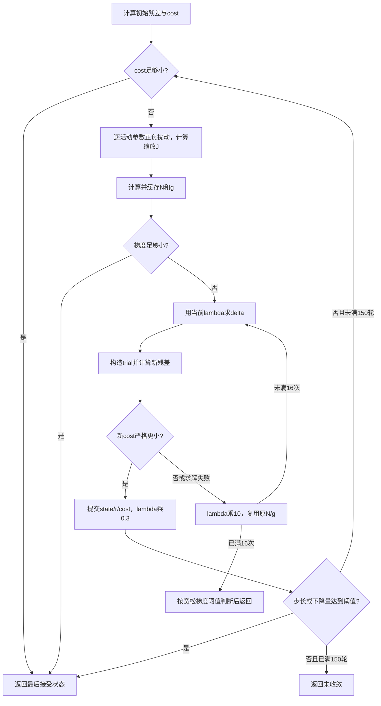

# LM 迭代模块与仿真

> 配置更新：本文的3视图、40点、27项状态等具体尺寸描述默认构建；可配置范围与当前接口以 [CONFIGURATION.md](../../../parameter/CONFIGURATION.md) 和 calib_defs.vh 为准。

`rtl/calibration/lm` 的四个模块已实现，保留原端口名称和位宽。内部使用现有自主 FP64 算术核、高斯求解核和投影模型核。RTL 不使用 `real`，TB 中的 `real` 只用于软件参考计算。

本层接受一份初值，对一个阶段执行 LM。三个阶段和多个 seed 的调度仍属于 `calib_top`；本次没有实现该顶层和最终结果检查模块，也不访问 DDR。

## 文件职责

| 文件 | 输入与输出 | 内部实现 |
| --- | --- | --- |
| [jacobian.v](../../../rtl/control/calibration/lm/jacobian.v) | 状态、stage → 多次残差请求、列序 J、scale | 逐列中心差分；缓存 plus/minus/差分三列；归一化后才输出本列 |
| [normal_equation.v](../../../rtl/control/calibration/lm/normal_equation.v) | 基准残差、列序 J → N 下三角、g、最大梯度 | 保存完整 J 和基准 r；每个点积按残差索引递增累加，算完一项就输出 |
| [damped_step.v](../../../rtl/control/calibration/lm/damped_step.v) | 一次 N/g 加载、多次 lambda → delta | 保留原始下三角与梯度；每次重新构造完整增广矩阵，调用高斯消元 |
| [lm_controller.v](../../../rtl/control/calibration/lm/lm_controller.v) | 初值、stage、角点读口 → 最后接受状态、cost、收敛标志、计数 | 独占一个真实残差核，调度差分、正规方程、阻尼重试和试探提交 |



## 算法细节

状态仍为 27 个 FP64，低位槽 0 在最低 64 位。活动列映射如下，其余槽保持初值中的数值；本层不主动改写 `k3`。

| stage | 活动状态索引，按列顺序 | 列数 |
| --- | --- | --- |
| 0 | 0、1、2、3、9…26 | 22 |
| 1 | stage0 后追加 4 | 23 |
| 2 | stage1 后追加 5、6、7 | 26 |

`R/t` 对应的旋转向量、平移和 `log(tz)` 始终参与迭代。

每列使用 `h=1e-6*(1+abs(p[index]))`。正扰动先计算 `q=p+h`，负扰动再从该值减 `2*h`，保留原 C++ 的舍入顺序。差分为 `(plus-minus)/(2*h)`，`scale=1/max(sqrt(sum(column²)),1e-12)`，输出的 J 已乘 scale。

正规方程为 `N=JᵀJ`、`g=Jᵀr`。本实现将输出元素放在外层循环，点积内部仍按 `t=0…239` 累加，与 C++ 每个累加器的加法顺序一致。输出顺序为下三角 `N[0,0],N[1,0],N[1,1],…`，随后 `g[0…n-1]`，仅最后一个 g 的 last 为 1。

阻尼求解构造 `(N+lambda*I)*delta=-g`。下三角采用 `row*(row+1)/2+col` 紧凑存储。每次求解都重新发送所有矩阵元素，不复用高斯消元已经修改的数据。LM 使用 `d=delta[k]*scale[k]` 更新活动状态，记录 `max(abs(d)/(1+abs(p)))`。

每阶段 lambda 从 `1e-3` 开始；拒绝乘 10，接受乘 0.3 且不小于 `1e-12`。以下比较均为严格小于：

- `cost < 1e-16`。
- `max_abs(g) < 1e-8*(1+sqrt(cost))`。
- 接受后，相对步长 `< 1e-9`，或下降量 `< 1e-11*(1+新cost)`。
- 16 次均未接受后，仅当 `max_abs(g) < 1e-5*(1+sqrt(cost))` 才报告收敛。

150 轮用尽不自动收敛。`accepted_steps` 仅在 trial 被提交时递增；`outer_iterations` 在实际开始构造本轮 J 前递增，初始 cost 已收敛时为 0。最后一轮若未达到接受后的停止条件，返回未收敛，与 C++ 循环结束的含义一致。

## 时序与失败处理

所有命令、残差流、矩阵流和响应均使用 valid/ready。响应背压期间保持全部载荷；一次只处理一个命令，响应消费后才能接下一命令。内部子核取消信号经过寄存器，不用多位状态直接组合译码驱动异步复位。角点读口沿用固定一拍契约：读地址在 E_n 被缓存采样，调用方在 E_(n+1) 消费返回，无返回背压。

LM 先将基准残差送入 normal，再启动 jacobian；差分期间残差核完全归 jacobian 所有，尺寸取 LM 已锁存的命令。jacobian 成功后才启动 damped_step 的 load，并转发 N/g。normal 的完成与 damped_step 的加载完成分别记账，允许不同周期返回。

试探残差保存在独立缓存。拒绝或失败的试探不会覆盖 current、基准残差或当前 cost。初始残差尚未成功时，cost 为 +Inf。

| 情况 | 行为 |
| --- | --- |
| 非法 stage、尺寸、索引顺序或 last | `PAR_BAD_CONFIG` |
| 角点未按约定返回 | `PAR_MEM_ERROR`，跨层保留该错误 |
| 初始/扰动状态导致残差无效 | LM 返回 OK、未收敛，保留 current；基准未建立时 cost 为 +Inf |
| 高斯求解数值失败、trial 无效或 cost 未下降 | 增大 lambda，重试，最多 16 次 |
| normal 数值错误或内部加载错误 | 错误响应，清理在途加载，不能当作收敛 |
| LM 自身有限数算术溢出 | 构造 trial 时拒绝重试；其他阶段停止并保留 current，未收敛 |
| 外部复位 | 取消所有在途事务，清除有效标记，不整体清空数组 |

jacobian 失败时，LM 显式 abort normal 并消费响应；normal 失败且 damped_step 尚在加载时，显式 load_abort 并消费响应。normal 在接收 r/J 时提前报错也会被立即接收，取消仍可能等待 J 背压的 jacobian。LM 进入终态时清理子核，防止迟到响应影响下一任务。normal 的 abort 优先于同周期输入和输出，可撤销未握手的 N/g；这是显式取消的语义，普通背压仍保持数据。

jacobian 会排空当前残差服务至完成响应，成功要求先前恰好收到 240 项、顺序和 last 正确；失败响应可以提前到达。damped_step 新 load 作废旧缓存，一次成功 load 最多接受 16 条 solve 命令；非法 lambda 也计入已接受命令数。第 16 次后需重新 load。load 与 solve 同拍有效时 load 优先。

接口不为上游永久停发数据或永久背压设置超时；系统顶层需要保证完整事务或执行取消/复位。

## 如何运行

```powershell
# 运行四个独立TB（均使用真实FP64算术与真实高斯核）
powershell -NoProfile -ExecutionPolicy Bypass -File scripts\calibration\run_lm.ps1

# 单独运行LM联调
powershell -NoProfile -ExecutionPolicy Bypass -File scripts\calibration\run_lm_controller.ps1

# 用原项目C++重新生成三个物理场景的参考向量，需要MSVC
powershell -NoProfile -ExecutionPolicy Bypass -File scripts\calibration\run_lm_reference.ps1
```

每个模块对应 `tb_<模块>.sv`、`run_<模块>.ps1`、`run_<模块>.do`。默认 ModelSim 路径可由 `-ModelSimBin` 覆盖，MSVC 路径可由 `-VsRoot` 覆盖。生成的编译库、结果、日志和波形位于对应 `build_<模块>`，已忽略。运行不要求重新生成参考向量。

## 验证方法与范围

最终版本在 ModelSim SE-64 10.1c 中通过 **83 组场景，0 错误**，包括数值、异常、握手、取消和复位恢复检查：

| 模块 | 场景数 | 错误数 |
| --- | ---: | ---: |
| jacobian | 12 | 0 |
| normal_equation | 15 | 0 |
| damped_step | 35 | 0 |
| lm_controller | 21 | 0 |

本次还重跑了 init 层原有 101 组场景和 14 组额外复位恢复测试，全部通过。

| TB | 参考与重点 |
| --- | --- |
| jacobian | 独立非线性解析残差服务；三阶段所有活动列；零导数；scale 高槽清零；提前失败、短成功、错误索引、无穷 cost、服务错误；命令/J/响应背压及复位恢复 |
| normal_equation | TB 用实数独立计算 dense J 的点积；三阶段及全零矩阵；流顺序、输入异常、算术溢出、加载/计算期间取消；输出背压及恢复 |
| damped_step | `N=diag(d)+u*uᵀ`，使用 Sherman–Morrison 解析解对比；三尺寸、不同 lambda 复用缓存；奇异矩阵、非法 lambda、16 次上限、错误加载、对角相加溢出后的再次求解及复位 |
| lm_controller | 三个真实 Brown 投影场景，完整执行差分→N/g→高斯→trial→多轮提交，与原 C++ 结果比较；另用明确标注的故障/边界注入覆盖难触发的控制分支 |

LM 数值向量由 [generate_lm_reference.cpp](../../../data/generators/calibration/generate_lm_reference.cpp) 直接调用原项目 `lm.cpp`、`residuals.cpp`、`matrix.cpp` 和 `math3.cpp` 生成，MSVC `/fp:strict`。观测先量化为 FP32，再调用 C++ 优化器。三个场景分别覆盖 stage0/1/2 的活动参数，初值对所有活动参数施加小扰动，最终各接受 6 步并收敛。

状态逐元素容差 `2e-7*(1+abs(reference))`，cost 容差 `2e-12*(1+abs(reference))`；接受步数、收敛标志和状态码精确比较。独立测试中，J/scale 容差为 `2e-9*(1+abs(reference))`，N/g 为 `3e-13*(1+abs(reference))`，线性解通常为 `1e-12*(1+abs(reference))`。另对非规格化微小线性解使用 `1e-320` 绝对量级检查。

三个未注入故障的物理场景实测如下。周期数从命令被接受后计数，只反映当前串行控制流程，不表示已经达到某个板上时钟频率。

| 阶段 | 外迭代数 | 接受步数 | 最终cost | 仿真周期数 |
| --- | ---: | ---: | ---: | ---: |
| stage0 | 6 | 6 | 1.3047766517501602e-8 | 15,466,702 |
| stage1 | 6 | 6 | 1.2301736265189115e-8 | 16,483,975 |
| stage2 | 7 | 6 | 1.2125574252139264e-8 | 22,382,954 |

stage2 最后一轮通过梯度条件退出，没有再接受更新，因此外迭代数大于接受步数。“先拒绝再接受”场景最终接受 8 步、拒绝 1 次并收敛，验证了重试后继续外迭代的路径。

联调使用固定一拍角点存储模型，并检查每个残差任务的 120 点访问顺序；本次 LM TB 没有实例化 corner_store。init 层已有真实 corner_store 联调。控制分支注入包括：扰动失败、连续拒绝、线性求解失败、normal/加载错误、严格和宽松梯度阈值、最后一轮边界、小步长停止、先拒绝再接受。迭代上限用计数器边界注入后真实执行最后一轮，未运行完整 150 轮压力场景。

尚未进行目标器件综合、块 RAM 推断确认和时序验证；这些功能仿真不能保证任意输入均无误，也不能代表板上性能。完整 J 单独需要 49,920 字节，另有残差、差分列、N/g 和高斯工作 RAM；多个子模块仍各自实例化浮点核，资源共享需结合综合报告决定。
